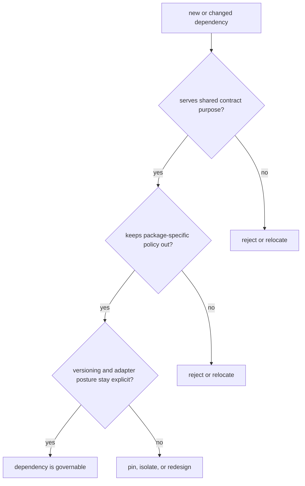

# Dependency Governance

Dependency governance is really boundary governance under another name.

For `bijux-proteomics-foundation`, a dependency change is acceptable only when it strengthens shared contract work without smuggling in package-specific policy or hidden operational ownership.

## Governance Model

This page should help a reviewer judge whether a dependency still belongs in a shared-contract package. If the dependency starts carrying local behavior, the package seam has already weakened.

## Review Rules

- keep dependencies minimal and shared-purpose
- do not add package-specific policy dependencies to foundation
- prefer versioned adapters over hidden dependency magic

## First Proof Check

- `packages/bijux-proteomics-foundation/tests`
- `src/bijux_proteomics_foundation/documents.py` and `migrations.py`
- `src/bijux_proteomics_foundation/serialization/`

## Design Pressure

The easy failure is to accept a convenient helper dependency that quietly turns foundation into the hidden owner of policy or operational behavior.
