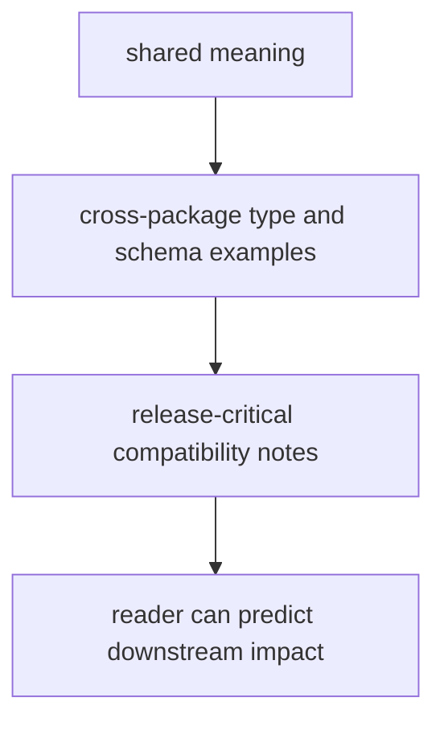

# Documentation Standards

Documentation standards should protect the reader from filler, drift, and false confidence.

For `bijux-proteomics-foundation`, documentation quality is mostly about explaining shared meaning before implementation detail and showing how that meaning travels across package boundaries.

## Documentation Model

This page should keep the documentation anchored on contract travel, not local code tours. If the docs stop helping readers predict downstream impact, they are already drifting.

## Review Rules

- docs should describe shared meaning before implementation detail
- examples should show how types travel across packages
- compatibility notes should read like release-critical guidance

## First Proof Check

- `packages/bijux-proteomics-foundation/tests`
- `src/bijux_proteomics_foundation/serialization/documents.py` and `migrations.py`
- `src/bijux_proteomics_foundation/serialization/`

## Design Pressure

The easy failure is to document foundation like a utility library and bury the cross-package contract story that readers actually need.
