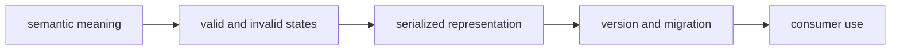

# Documentation standards

Foundation documentation is the public dictionary for meanings shared by
multiple packages. Each contract description must make construction,
serialization, versioning, failure, and ownership predictable without asking a
reader to reconstruct behavior from implementation helpers.

## Required contract record

| Contract concern | Public record must state |
| --- | --- |
| semantic meaning | what the value represents and what it explicitly does not represent |
| valid state | required fields, normalization, units, ranges, and cross-field invariants |
| invalid state | exception, failure, or refusal shape and whether partial data survives |
| serialized form | canonical fields, ordering or normalization guarantees, and schema version |
| compatibility | supported reader/writer versions, migration direction, and rejection behavior |
| provenance | which source identity and transformations remain attached |
| ownership | Foundation owns the shared shape; the consuming package owns domain policy |

## Meaning before representation

Lead with meaning, then show the representation. A JSON example without its
invariants is only syntax. A migration example without source and target
semantics is only data movement. A hash example without the canonical input
contract is not a reproducibility claim.

## Public language

- **canonical** means the package defines one normalized representation for
  the supported input domain; it does not mean every Python value is accepted;
- **stable** names the exact dimension—bytes, value, schema, or public import—
  and the versions across which it holds;
- **compatible** names reader, writer, source version, target version, and
  failure behavior;
- **refusal** is a deliberate non-execution outcome, not an exception alias;
- **provenance preserved** names the fields and transformations that remain
  reviewable.

Examples should cross at least one real package boundary when the claim is
cross-package. Link the protecting Foundation test and the relevant consumer
test. Do not use a utility function’s existence as evidence that every consumer
uses it correctly.

The [data contracts](../interfaces/data-contracts.md) describe public shapes;
[known limitations](known-limitations.md) explains where those guarantees end.
