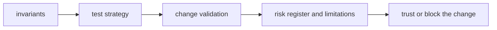

# Quality

`bijux-proteomics-foundation` quality should tell a reviewer what must remain true, what proof is required, and which risks are serious enough to block a change.

## Trust Model

This page should frame quality as the review surface for shared meanings. The
foundation package is trustworthy only when identifiers, schemas, migrations,
and serialization rules stay stable enough for downstream packages to reuse.

## Start With

- open [Invariants](https://bijux.io/bijux-proteomics/03-bijux-proteomics-foundation/quality/invariants/) before changing package meaning
- open [Change Validation](https://bijux.io/bijux-proteomics/03-bijux-proteomics-foundation/quality/change-validation/) when you need the minimum proof for a real edit
- open [Risk Register](https://bijux.io/bijux-proteomics/03-bijux-proteomics-foundation/quality/risk-register/) when the package boundary feels under pressure

## Section Pages

- [Invariants](https://bijux.io/bijux-proteomics/03-bijux-proteomics-foundation/quality/invariants/)
- [Test Strategy](https://bijux.io/bijux-proteomics/03-bijux-proteomics-foundation/quality/test-strategy/)
- [Change Validation](https://bijux.io/bijux-proteomics/03-bijux-proteomics-foundation/quality/change-validation/)
- [Definition of Done](https://bijux.io/bijux-proteomics/03-bijux-proteomics-foundation/quality/definition-of-done/)
- [Dependency Governance](https://bijux.io/bijux-proteomics/03-bijux-proteomics-foundation/quality/dependency-governance/)
- [Documentation Standards](https://bijux.io/bijux-proteomics/03-bijux-proteomics-foundation/quality/documentation-standards/)
- [Known Limitations](https://bijux.io/bijux-proteomics/03-bijux-proteomics-foundation/quality/known-limitations/)
- [Review Checklist](https://bijux.io/bijux-proteomics/03-bijux-proteomics-foundation/quality/review-checklist/)
- [Risk Register](https://bijux.io/bijux-proteomics/03-bijux-proteomics-foundation/quality/risk-register/)

## What Quality Means Here

- proving shared meanings stay stable, versioned, and reusable across package boundaries

## First Proof Check

- `packages/bijux-proteomics-foundation/tests`
- `src/bijux_proteomics_foundation/schema.py` and `migrations.py`
- `src/bijux_proteomics_foundation/serialization.py`

## Design Pressure

Foundation quality fails when shared meaning can drift quietly behind migration
or serialization helpers. The section has to keep canonical meaning and
downstream proof tightly linked.
