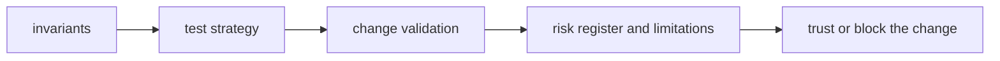
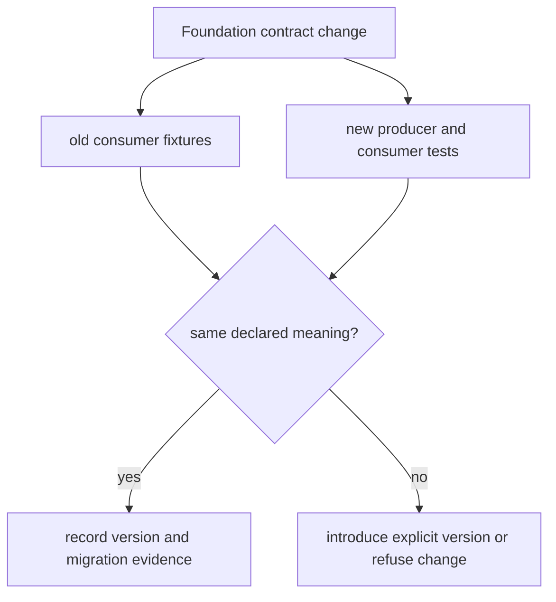

# Quality

Foundation quality protects meanings shared across package boundaries:
identifier identity, document schemas, canonical serialization, migration
direction, and typed outcome semantics. A locally convenient change is blocked
when an existing consumer could read the same record differently.

## Trust Model

The package is trustworthy only when a downstream consumer can reproduce the
same structural judgment without importing producer internals.

## Protected contracts

| Contract | Evidence of stability | Release-blocking drift |
| --- | --- | --- |
| typed identifiers | namespace, syntax, equality, hashing, and round-trip tests | two subjects collide or one subject changes identity after serialization |
| document schema | strict validation, version assessment, and old-reader fixtures | unknown fields or versions are silently accepted with altered meaning |
| canonical JSON | deterministic ordering and explicit scientific-value handling | equal payloads hash differently or unsupported values are coerced |
| migration | declared source and target versions, lineage, and target validation | reverse, lossy, or implicit transformation lacks domain approval |
| typed outcomes | produced, refused, failed, and dependency-absent cases remain distinct | missing work appears as successful empty output |
| root exports | curated symbol inventory and lazy import checks | shared import pulls product policy or heavyweight optional dependencies |

## Start With

- open [Invariants](https://bijux.io/bijux-proteomics/03-bijux-proteomics-foundation/quality/invariants/) before changing package meaning
- open [Change Validation](https://bijux.io/bijux-proteomics/03-bijux-proteomics-foundation/quality/change-validation/) when you need the minimum proof for a real edit
- open [Risk Register](https://bijux.io/bijux-proteomics/03-bijux-proteomics-foundation/quality/risk-register/) when the package boundary feels under pressure

## Section Pages

- [Invariants](https://bijux.io/bijux-proteomics/03-bijux-proteomics-foundation/quality/invariants/)
- [Test Strategy](https://bijux.io/bijux-proteomics/03-bijux-proteomics-foundation/quality/test-strategy/)
- [Change Validation](https://bijux.io/bijux-proteomics/03-bijux-proteomics-foundation/quality/change-validation/)
- [Definition of Done](https://bijux.io/bijux-proteomics/03-bijux-proteomics-foundation/quality/definition-of-done/)
- [Dependency Governance](https://bijux.io/bijux-proteomics/03-bijux-proteomics-foundation/quality/dependency-governance/)
- [Documentation Standards](https://bijux.io/bijux-proteomics/03-bijux-proteomics-foundation/quality/documentation-standards/)
- [Known Limitations](https://bijux.io/bijux-proteomics/03-bijux-proteomics-foundation/quality/known-limitations/)
- [Review Checklist](https://bijux.io/bijux-proteomics/03-bijux-proteomics-foundation/quality/review-checklist/)
- [Risk Register](https://bijux.io/bijux-proteomics/03-bijux-proteomics-foundation/quality/risk-register/)

## First proof route

1. Name the exact shared meaning being changed and every consuming package.
2. Run Foundation contract and round-trip tests under
   `packages/bijux-proteomics-foundation/tests`.
3. Inspect `serialization/document_schema.py`,
   `compatibility/schema_migrations.py`, and the canonical serialization
   owner when persisted bytes or versions move.
4. Exercise an old-reader fixture and a current-reader fixture.
5. Require the domain owner to approve any claimed preservation of scientific
   meaning; schema validity alone is insufficient.

## Design Pressure

Foundation quality fails when a migration or serializer preserves valid bytes
while changing what a downstream package believes those bytes mean. Structural
compatibility and scientific equivalence remain separate verdicts.
