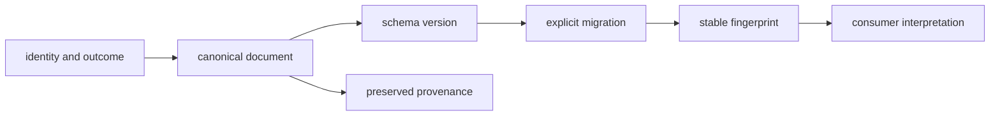

# Invariants

Foundation contracts allow independently owned packages to exchange identity,
outcomes, provenance, and serialized documents without negotiating meaning at
every call site.

## Shared-contract invariants

| Invariant | What must remain true | Observable violation |
| --- | --- | --- |
| identity is explicit | identifiers retain namespace, validation, equality, and canonical representation | two spellings compare equal accidentally or one spelling changes identity after round trip |
| outcome classes stay distinct | success, failure, refusal, absence, and optional-dependency failure remain distinguishable | a consumer must inspect text to recover outcome class |
| canonical serialization is deterministic | supported normalized values produce the same ordered JSON bytes | map order, unsupported values, or environment changes alter bytes silently |
| documents declare schema version | every governed document can be routed to validation or migration deliberately | a reader guesses version from fields |
| migration is explicit | source, target, transformation, and loss behavior are registered and tested | coercion accepts an old payload while changing meaning silently |
| fingerprints follow canonical meaning | equal canonical inputs hash equally and semantic changes alter the fingerprint | formatting alone changes identity or changed meaning reuses a fingerprint |
| provenance survives transformation | source identity and declared transformations remain attached | normalized output cannot be traced to its source |
| Foundation remains policy-free | shared primitives do not choose scientific, recommendation, execution, or laboratory policy | a shared type embeds one consumer’s decision rule |

## Stability dimensions

Byte stability, value stability, schema compatibility, and import stability are
separate promises. A canonical JSON test establishes bytes only for supported
values. A migration test establishes one registered version path. A public API
guard establishes imports, not downstream interpretation.

## Boundary invariant

Foundation may define the shared representation of a reason code, refusal, or
provenance record. It does not decide when Core accepts a scientific result,
when Intelligence recommends an action, when Runtime executes, when Knowledge
resolves evidence, or when Lab authorizes work.

When an invariant fails, repair the canonical contract or introduce an explicit
version and migration. Do not add consumer-specific aliases or permissive
coercion that makes incompatible meanings look compatible.
