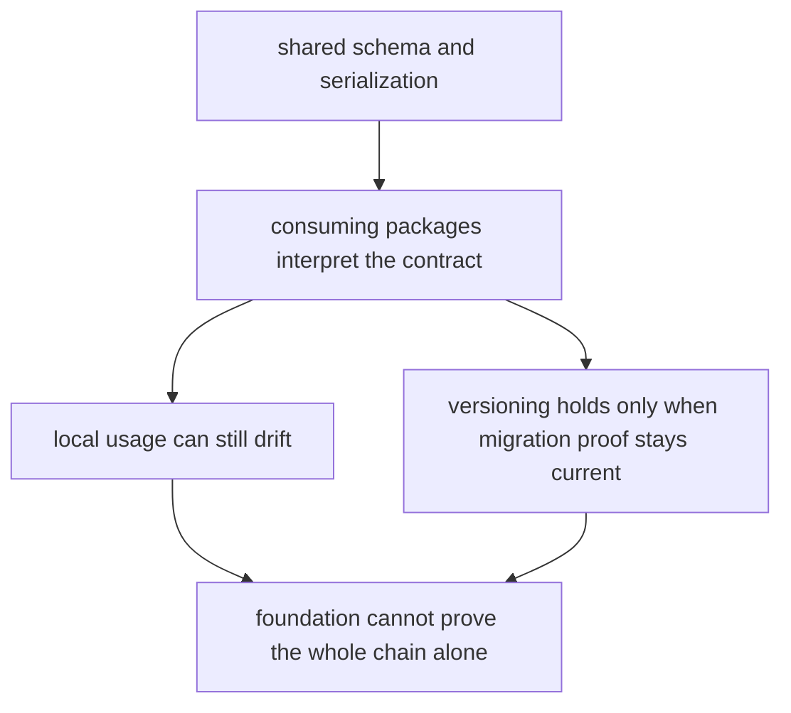

# Known Limitations

Known limitations matter because honest boundaries are part of quality, not an admission of failure.

For `bijux-proteomics-foundation`, limitations are mostly about what shared contracts cannot prove once they leave the package boundary.

## Limitation Model

This page should keep the reader from confusing strong shared contracts with total downstream control. The package can define the language, but it cannot force every consumer to honor it correctly by prose alone.

## Review Rules

- foundation cannot prove downstream usage by itself
- shared types still depend on consuming packages to honor them correctly
- versioning discipline is only as strong as the migration tests that enforce it

## First Proof Check

- `packages/bijux-proteomics-foundation/tests`
- `src/bijux_proteomics_foundation/schema.py` and `migrations.py`
- `src/bijux_proteomics_foundation/serialization.py`

## Design Pressure

The dangerous illusion is to treat well-specified shared meaning as if it automatically guarantees correct downstream behavior.
