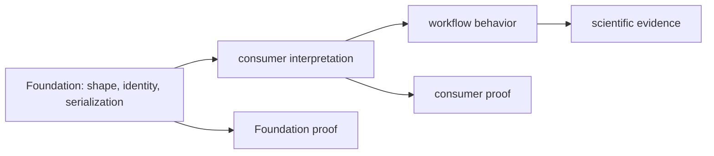

# Known limitations

Foundation makes shared values deterministic and portable within declared
contracts. It does not prove that a downstream scientific workflow chose the
right value, interpreted it correctly, or preserved it through an undeclared
integration.

## Contract limits

| Limitation | Consequence | Honest interpretation |
| --- | --- | --- |
| identifiers establish stable identity syntax, not biological equivalence | two valid identifiers may still refer to records that require domain reconciliation | use Knowledge or the scientific owner for equivalence claims |
| canonical JSON covers supported normalized values | arbitrary objects and environment-dependent encodings are outside the guarantee | validate inputs before claiming byte stability |
| fingerprints are deterministic for canonical input | they do not establish provenance, authenticity, or scientific correctness by themselves | retain source and transformation records separately |
| document validation enforces declared schema | a schema-valid document can still contain scientifically weak evidence | pair schema proof with the package that owns scientific meaning |
| migrations cover registered version paths | unregistered, lossy, or skipped versions are not implicitly compatible | require an explicit fixture and loss policy for each path |
| result, failure, and refusal primitives preserve outcome categories | consumers can still flatten those categories incorrectly | test the consuming branch and published representation |
| public test helpers enforce repository contracts | they do not substitute for package-specific scientific tests | keep owner evidence next to owner claims |

## Guarantee boundary

Foundation proof ends at the shared contract. Claims about recommendation,
execution, evidence strength, assay outcome, or biological truth require proof
from Intelligence, Runtime, Knowledge, Lab, or Core as appropriate.

## Reporting compatibility

State the precise envelope: for example, “canonical JSON is byte-stable for the
document primitives covered by the round-trip fixtures,” or “schema version A
migrates to B through the registered migration.” Avoid “serialization is
stable” when only one document family or direction was tested.

When consumer evidence has not run, report the Foundation result as local
contract proof and leave cross-package compatibility unresolved.
