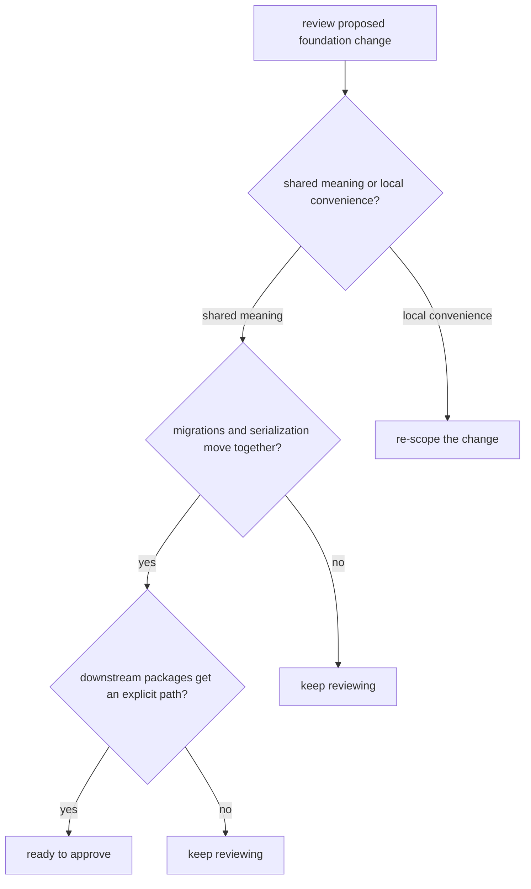

# Review Checklist

A review checklist is useful only if it catches the real ways this package can drift.

For `bijux-proteomics-foundation`, good review starts by asking whether a change really belongs in shared meaning or whether local convenience is trying to promote itself to system truth.

## Review Model

This checklist should catch the moment a seemingly small schema or serialization edit starts forcing every consumer to reinterpret the package on its own.

## Review Rules

- ask who else consumes the shared meaning
- check whether the proposed change is truly shared or only locally convenient
- verify migrations, serialized forms, and docs move together

## First Proof Check

- `packages/bijux-proteomics-foundation/tests`
- `src/bijux_proteomics_foundation/schema.py` and `migrations.py`
- `src/bijux_proteomics_foundation/serialization.py`

## Design Pressure

The risk is approving a change because it is tidy in one package while missing that it quietly rewrites shared meaning for the rest of the repository.
