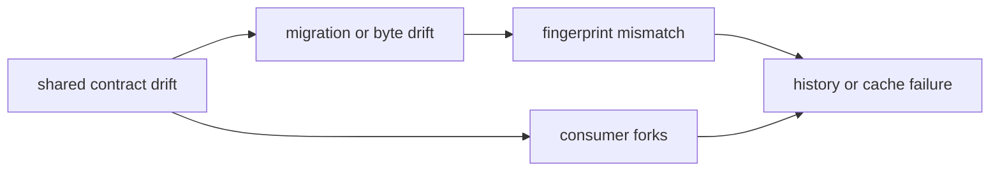

# Risk register

Foundation failures propagate quietly because consumers can remain locally
green while interpreting the same shared record differently.

| Risk | Early signal | Consequence | Required control |
| --- | --- | --- | --- |
| semantic drift | field or identifier meaning changes without versioning | consumers agree on shape but disagree on meaning | invariant record, explicit version, consumer proof |
| silent coercion | old or invalid payload is accepted through defaults | incompatibility is hidden until downstream behavior | reject or register a migration with loss policy |
| canonical-byte drift | dependency, ordering, float, or datetime handling changes | fingerprints and retained artifacts change | byte fixtures over supported values |
| migration loss | provenance, outcome class, precision, or unknown field disappears | history becomes unrecoverable | source/target fixtures and explicit loss report |
| fingerprint misuse | volatile metadata enters stable identity or semantic fields are omitted | false cache miss or false identity | declared scope and equal/changed meaning tests |
| policy leakage | shared primitive embeds one consumer’s rule | Foundation becomes an accidental product owner | move policy downstream and keep neutral representation |
| consumer fork | package copies or locally reinterprets a shared type | two contract dialects emerge | public import and cross-package boundary guards |
| dependency behavior drift | Pydantic or another admitted library changes public behavior | source-compatible release breaks bytes, schemas, or errors | constrained version and upgrade validation |
| provenance detachment | normalized record loses source or transformation | artifact cannot be audited | provenance invariant and round trip |

Schema/version ambiguity, irreversible migration loss, fingerprint collision or
reuse, and reverse dependencies from product packages are release-blocking.
Other risks remain open until named evidence closes them; local test success
does not downgrade their severity.
