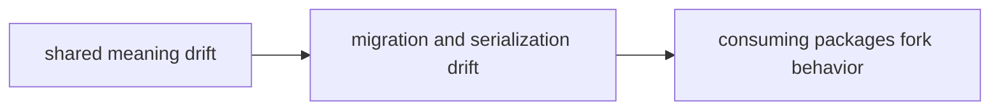

# Risk Register

A risk register should name the structural and behavioral failures that deserve ongoing attention.

## Risk Model

This page should make foundation risk look systemic rather than abstract. The
danger is not one broken helper; it is that shared meaning stops being shared
while the repository still talks as if it is.

## Review Rules

- shared types start carrying policy that belongs elsewhere
- migration promises drift from actual serialized payloads
- consuming packages fork the meaning in practice

## First Proof Check

- `packages/bijux-proteomics-foundation/tests`
- `src/bijux_proteomics_foundation/schema.py` and `migrations.py`
- `src/bijux_proteomics_foundation/serialization.py`

## Design Pressure

Foundation risk becomes expensive when downstream forks reality before the
maintainers notice. The register has to keep shared meaning drift visible
enough to trigger action early.
