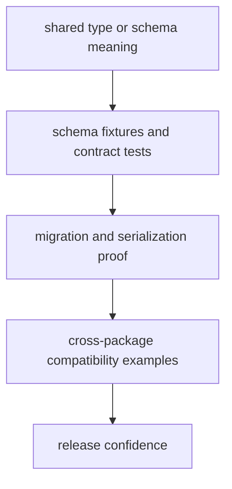

# Test Strategy

A useful test strategy names what evidence is needed and why shallow coverage is not enough.

For `bijux-proteomics-foundation`, the test story should show how shared meaning survives schema edits, serialization pressure, and package migration instead of treating those concerns as unrelated checks.

## Strategy Model

The important thing here is stacking evidence from local correctness to downstream compatibility. If the strategy stops at unit-level proof, the package has not actually defended its shared role.

## Review Rules

- favor schema, serialization, and migration tests over generic breadth
- use fixtures that represent real downstream compatibility pressure
- treat cross-package examples as quality proof, not just docs ornament

## First Proof Check

- `packages/bijux-proteomics-foundation/tests`
- `src/bijux_proteomics_foundation/serialization/document_schema.py` and `compatibility/schema_migrations.py`
- `src/bijux_proteomics_foundation/serialization/`

## Design Pressure

The easy failure is broad green coverage that never proves whether consuming packages can still interpret the edited shared meaning the same way.
