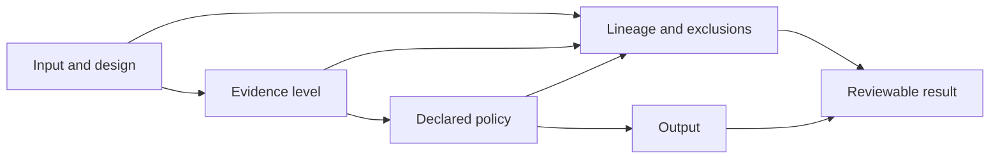

# Architecture Risks

Core’s breadth creates a particular risk: a scientifically plausible output can look trustworthy after the assumptions, exclusions, or evidence level that produced it have been lost.

| Risk | Consequence | Control |
| --- | --- | --- |
| Evidence-level collapse | PSM, peptide, protein group, protein, site, and proteoform results are treated as interchangeable | Preserve typed levels and explicit aggregation contracts |
| Silent row loss | Invalid or filtered source records disappear from totals | Retain source-row lineage and rejected-evidence tables |
| FDR scope drift | A threshold is applied at a different level or competition scope | Record target-decoy policy, evidence level, threshold, and audit trail |
| Protein ambiguity erasure | Shared peptides are reported as unique protein evidence | Preserve groups, mapping ambiguity, and parsimony policy |
| PTM over-localization | A modified peptide is presented as a resolved site without sufficient fragment evidence | Retain candidate sites, probabilities, and localization tier |
| Quantification opacity | Normalization, imputation, missingness, or roll-up changes meaning invisibly | Emit provenance and diagnostics with matrices |
| Context leakage | Annotation or enrichment is interpreted without foreground, background, species, or reference context | Bind interpretation to explicit context contracts |
| Workflow monolith | Composition code becomes the only usable scientific API | Keep scientific families callable and testable independently |
| Runtime coupling | Scheduling or service state changes scientific results | Keep computation deterministic and runtime-independent |

The strongest control is not a success flag; it is the ability to reconstruct why each retained and rejected result has its current meaning.

## Diagnose a changed scientific result

Compare in causal order so a downstream numerical difference is not blamed on
the wrong surface.

| Compare | Question | Owner record |
| --- | --- | --- |
| input and experimental design | did the eligible population, reference, grouping, or contrast change? | source and design identities |
| parser and normalization | were rows interpreted, filtered, keyed, or normalized differently? | accepted and rejected intake reports |
| evidence level and aggregation | did PSM, peptide, group, protein, site, or proteoform meaning change? | typed evidence-level and roll-up contracts |
| scientific policy | did thresholds, competition, inference, missingness, imputation, or QC change? | versioned policy and parameters |
| implementation | did the algorithm change under stable inputs and policy? | implementation revision, focused tests, and reference vectors |
| benchmark burden | does the changed result still satisfy the family-specific acceptance and perturbation evidence? | benchmark report, challenge corpus, and limitation record |

Only after the earlier rows match is an implementation regression the leading
explanation. If the result change is intentional, its release record must name
the affected evidence level, workflow families, consumers, and public claim
ceiling.
