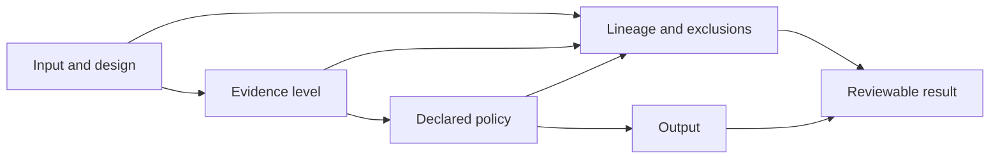

# Architecture Risks

Core’s breadth creates a particular risk: a scientifically plausible output can look trustworthy after the assumptions, exclusions, or evidence level that produced it have been lost.

| Risk | Consequence | Control |
| --- | --- | --- |
| Evidence-level collapse | PSM, peptide, protein group, protein, site, and proteoform results are treated as interchangeable | Preserve typed levels and explicit aggregation contracts |
| Silent row loss | Invalid or filtered source records disappear from totals | Retain source-row lineage and rejected-evidence tables |
| FDR scope drift | A threshold is applied at a different level or competition scope | Record target-decoy policy, evidence level, threshold, and audit trail |
| Protein ambiguity erasure | Shared peptides are reported as unique protein evidence | Preserve groups, mapping ambiguity, and parsimony policy |
| PTM over-localization | A modified peptide is presented as a resolved site without sufficient fragment evidence | Retain candidate sites, probabilities, and localization tier |
| Quantification opacity | Normalization, imputation, missingness, or roll-up changes meaning invisibly | Emit provenance and diagnostics with matrices |
| Context leakage | Annotation or enrichment is interpreted without foreground, background, species, or reference context | Bind interpretation to explicit context contracts |
| Workflow monolith | Composition code becomes the only usable scientific API | Keep scientific families callable and testable independently |
| Runtime coupling | Scheduling or service state changes scientific results | Keep computation deterministic and runtime-independent |

The strongest control is not a success flag; it is the ability to reconstruct why each retained and rejected result has its current meaning.
