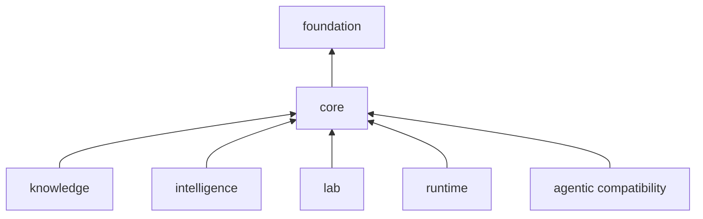

# Dependency Direction

Core depends on foundation for shared identity and document contracts, then supplies scientific capabilities to the higher packages. It must remain usable without intelligence, knowledge, lab, runtime, or the historical agentic namespace.

## Internal direction

The source tree is broad, but dependencies still follow scientific meaning:

- domain, sequence, chemistry, and study contracts form the lower scientific vocabulary;
- ingestion converts external formats into those internal contracts;
- identification consumes spectra, sequence, chemistry, and study context;
- quantification consumes identified evidence and retains provenance;
- PTM, DIA, multiplex, isotope-labeling, proteoform, and targeted analyses specialize those foundations;
- interpretation consumes reviewable scientific results rather than raw service state;
- workflows compose family APIs, while interfaces translate user input into workflow calls.

Private shared helpers such as atomic files and tabular output support multiple families but do not become an alternative public API.

## External libraries

Pydantic carries typed contracts; NumPy and Biopython support numerical and sequence work; `defusedxml` protects XML ingestion; Click exposes the command interface; Loguru provides logging. PyArrow is optional and required only for Parquet support. Optional formats must fail explicitly when their dependency is absent rather than changing results silently.

## Forbidden reverse edges

Core scientific functions must not import runtime state, service adapters, agent policy, evidence-memory policy, or lab planning. A higher layer may compose a core operation and attach its own decision record; core must not reach upward to obtain that decision. This keeps a scientific calculation reproducible in a notebook, test, batch worker, or service without changing its semantics.
