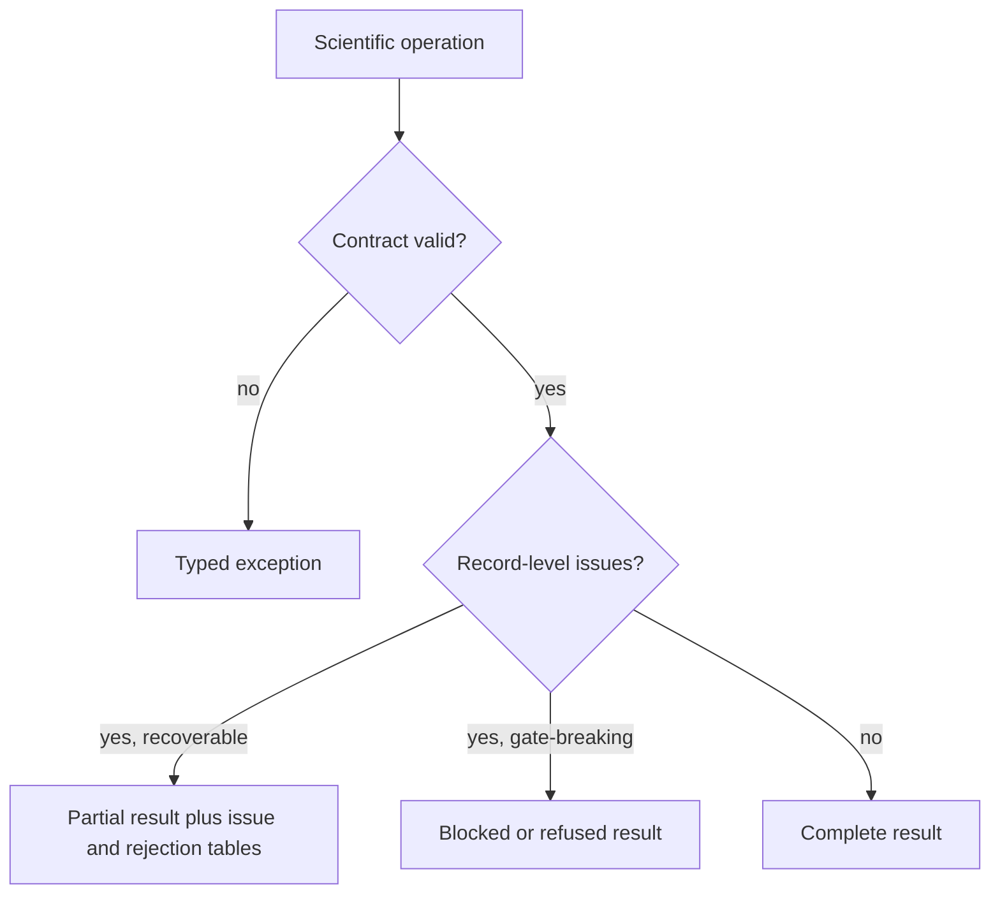

# Error Model

Core uses exceptions for operations that cannot satisfy their contract and structured issues for scientific findings that must remain reviewable alongside partial or rejected data.

## Exception boundaries

| Exception | Meaning |
| --- | --- |
| `SchemaError` | A payload does not satisfy the expected shape |
| `DesignError` | Experimental design is invalid for the requested analysis |
| `ScientificEvidenceError` | Available evidence cannot support the requested scientific result |
| `UnsupportedFormatError` | No supported parser or adapter can interpret the input format |
| `InvalidWorkflowError` | A workflow composition violates its declared contract |
| `ProgramValidationError` | Program validation produced governed issues |
| `ReviewGateBlockedError` | A named scientific or review gate prevents progression |
| `InvalidLifecycleTransitionError` | A requested state transition is not allowed |
| `MissingExecutionBackendError` | An explicitly requested external execution backend is unavailable |

Structured issue models cover sequence, spectrum, format, input integrity, search configuration, decoy strategy, identification, quantification, PTM, experimental design, annotations, workflow output, and scientific-consistency findings. They retain codes and row or entity context so a report can include rejected material without turning it into valid evidence.

Empty output is not a universal error representation. “No identifications,” “all rows rejected,” “unsupported format,” “failed QC,” and “no biological effect” carry different scientific meanings and require different evidence.

## Triage an empty or partial result

| Observation | Scientific interpretation | Required next record |
| --- | --- | --- |
| parser accepted no records | input, mode, or format did not yield a valid scientific record | parse report with source identity and row-level rejection reasons |
| identification produced no accepted PSMs | no candidate survived the declared search and confidence policy | search configuration, score distribution, decoy behavior, threshold, and rejected candidates |
| every quantitative row failed QC | measurements existed but none satisfied the declared quality burden | per-row QC, missingness, normalization state, exclusion rule, and affected samples |
| comparison reports no effect | the modeled contrast did not support an effect under the declared design | design matrix, estimator, uncertainty, multiplicity policy, and detectable-effect limits |
| format or workflow is unsupported | Core cannot interpret or compose the requested contract | typed exception or refusal naming the supported alternatives |
| backend is unavailable | a requested external capability cannot execute | backend identity, environment, missing capability, and whether import remains valid |
| some records remain usable | the result is partial, not empty | accepted and rejected partitions plus aggregation and claim limitations |

Consumers must not replace any of these outcomes with an empty dataframe or
zero-valued summary. The distinction determines whether to correct input,
change scientific policy, restore capability, narrow the claim, or accept a
null result.
