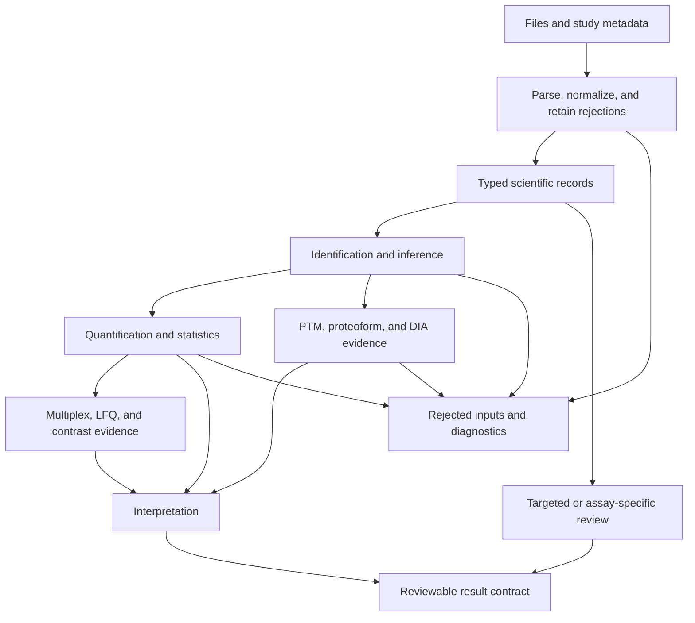
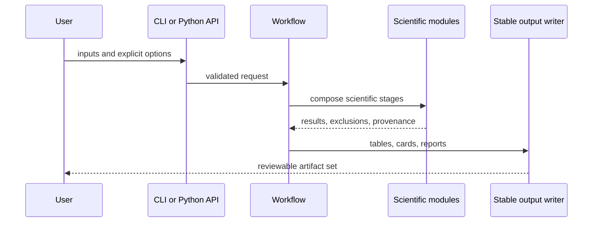

# Execution Model

Core executes scientific transformations as explicit, inspectable stages. Each stage accepts declared inputs, validates its assumptions, emits stable outputs, and preserves enough lineage to explain exclusions and derived values.

No arrow converts an upstream pass into downstream acceptance. Each branch
revalidates the assumptions it owns, and a valid branch may stop with a
reviewable partial result when another branch is unsupported.

## Stage contracts

Ingestion does more than load files: it establishes format validity, sample and run identity, source-row lineage, and experimental-design consistency. Identification converts search output into explicit PSM, peptide, and protein evidence and records target-decoy and grouping decisions. Quantification carries normalization, missingness, roll-up, statistics, and QC choices forward instead of presenting a matrix without its derivation.

Specialized stages add acquisition or biological semantics—DIA transition evidence, multiplex interference, isotope labels, PTM localization, proteoforms, targeted assays—without discarding their upstream evidence. Interpretation then maps results to annotation, pathways, complexes, regulators, or biological context. Review modules package claims, evidence graphs, explanations, and structural diagnostics for inspection.

| Stage boundary | Required retained evidence | Refuse or degrade when |
| --- | --- | --- |
| source to normalized records | file identity, parser policy, accepted and rejected counts, source-row lineage | format, identity, or required metadata cannot be interpreted |
| normalized records to identifications | score direction, target-decoy state, tie and threshold policy, inference ambiguity | error control or protein attribution is not defensible |
| identifications to quantities | roll-up, normalization, missingness, uncertainty, exclusions | the requested contrast is underdetermined or QC fails |
| quantities to specialized evidence | family-specific policy, interference or localization evidence, caveats | family assumptions are violated or support is incomplete |
| evidence to interpretation | claim, contrast, support, contradiction, and limiting uncertainty | the evidence ceiling is weaker than the requested sentence |

## Invocation paths

The CLI and Python entrypoints are adapters over the same owned functions. Workflow modules compose calculations; they do not replace family-level contracts. Runtime may schedule these calls and manage run state, but the result of a scientific function must not depend on whether it was invoked from a terminal, notebook, worker, or HTTP service.

## Determinism and refusals

Stable ordering, explicit policies, atomic writes, and retained provenance make repeat execution comparable. Malformed inputs, invalid designs, unsupported formats, and scientifically insufficient evidence are reported as such. They must not be converted into empty success, silently imputed, or omitted from the audit trail.

A comparable rerun therefore requires more than matching final tables. The
request, normalized inputs, policy objects, exclusion sets, software identity,
and output fingerprints must agree or be explained. Runtime records that
execution comparison; core determines whether the scientific result remains
acceptable under the declared contract.
