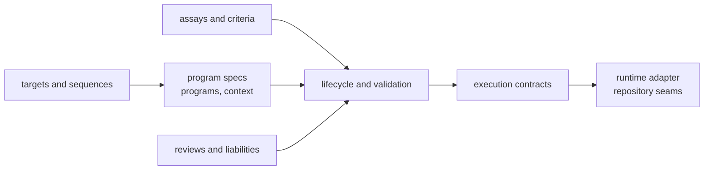

# Architecture

`bijux-proteomics-core` architecture is where the repository's governing domain
rules become explicit. This section should help a reader see how protein
programs, lifecycle checks, assays, reviews, and execution contracts fit
together before runtime or intelligence packages act on them.

## Architectural Promise

- program meaning is decided here before orchestration starts
- lifecycle progression should be explainable from explicit contracts, not from
  incidental runtime behavior
- downstream packages may consume these rules, but they should not have to
  reinvent them

## Start With

- open [Execution Model](https://bijux.io/bijux-proteomics/04-bijux-proteomics-core/architecture/execution-model/)
  when the question is how program state becomes execution readiness without
  collapsing into runtime orchestration
- open [Module Map](https://bijux.io/bijux-proteomics/04-bijux-proteomics-core/architecture/module-map/)
  when you need the owning domain files for a concrete noun such as review,
  assay, program, or target
- open [Integration Seams](https://bijux.io/bijux-proteomics/04-bijux-proteomics-core/architecture/integration-seams/)
  when a change seems to pull runtime control or recommendation logic inward

## Read This Section To Answer

- where stage progression authority actually lives:
  [Lifecycle](https://bijux.io/bijux-proteomics/04-bijux-proteomics-core/architecture/execution-model/)
  and [Validation](https://bijux.io/bijux-proteomics/04-bijux-proteomics-core/architecture/error-model/)
- how domain structures stay legible:
  [State and Persistence](https://bijux.io/bijux-proteomics/04-bijux-proteomics-core/architecture/state-and-persistence/)
  and [Code Navigation](https://bijux.io/bijux-proteomics/04-bijux-proteomics-core/architecture/code-navigation/)
- what can be safely extended:
  [Extensibility Model](https://bijux.io/bijux-proteomics/04-bijux-proteomics-core/architecture/extensibility-model/)
  and [Architecture Risks](https://bijux.io/bijux-proteomics/04-bijux-proteomics-core/architecture/architecture-risks/)

## First Proof Check

- `src/bijux_proteomics/program_spec.py`, `programs.py`, and `targets.py` for durable contracts
- `src/bijux_proteomics/lifecycle.py`, `validation.py`, and `execution_contracts.py` for readiness and execution rules
- `src/bijux_proteomics/biology/`, `domain/`, and `runtime_adapter.py` for structural seams to neighboring concerns

## Boundary Test

If a rule changes who may advance a program or what counts as ready, the answer
should be obvious in this package before any runtime workflow is consulted.
