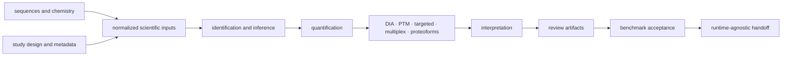
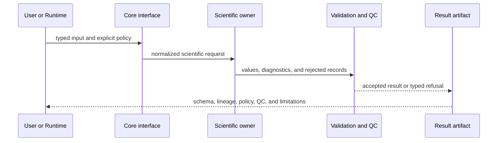

# Scientific architecture

`bijux-proteomics-core` is organized around scientific responsibility rather
than one universal pipeline. Sequence and chemistry establish the search space;
I/O and study contracts establish experimental context; identification and
quantification produce primary results; specialized workflow families add
acquisition-specific rules; interpretation and review create bounded scientific
artifacts; benchmarks test whether those artifacts support public claims.

An analysis may enter or leave at several points. FASTA inspection, theoretical
digestion, search-result normalization, FDR review, LFQ, PTM localization, and
targeted-panel design are valid independent workflows when their contracts and
limitations remain attached.

## Responsibility map

| Architectural family | Owns | Does not own |
| --- | --- | --- |
| `sequences`, `chemistry` | FASTA identity, digestion, masses, modifications, isotopes, fragments | search-engine execution |
| `io`, `study`, `domain` | normalized inputs, design, metadata, run and program contracts | provider scheduling or service state |
| `identification` | adapters, PSMs, target-decoy FDR, contaminants, protein inference | truth of external engine internals |
| `quantification` | matrices, normalization, missingness, roll-up, statistics, batch effects | biological recommendation policy |
| `dia`, `ptm`, `targeted`, `multiplex`, `isotope_labeling`, `proteoforms` | workflow-specific contracts, QC, and review | borrowed maturity from another family |
| `interpretation`, `biology`, `review` | pathways, contrasts, evidence cards, claims, explanations | durable evidence memory or action authority |
| `workflow`, `benchmarks` | composition, challenge corpora, acceptance bars, trust bundles | runtime process ownership |

The [module map](module-map.md) gives the detailed source ownership for each
family. [Dependency direction](dependency-direction.md) explains which imports
are permitted across these boundaries.

## Contract flow

Normalization is part of the scientific boundary. Input records are not
silently repaired when doing so would change their interpretation. Rejected
records, defaults, score orientation, thresholds, and adapter identity remain
available to the result artifact.

## State and persistence

Core models scientific state: accepted inputs, policies, intermediate evidence,
QC, and result disposition. Runtime models process state: planning, running,
checkpointing, retry, failure, and replay. The distinction prevents a completed
process from being mistaken for an accepted scientific result.

[State and persistence](state-and-persistence.md) covers durable Core artifacts;
[execution model](execution-model.md) defines the runtime-agnostic request and
result seam. Cross-process documents use Foundation serialization, identity,
schema, and compatibility contracts.

## Extension rules

Add a capability to the scientific family that owns its meaning. A new search
adapter belongs with identification; a new normalization method belongs with
quantification; a workflow-specific acceptance rule belongs with that workflow
and its benchmarks. A facade may expose an owner—it must not reimplement it.

Extensions require:

1. typed inputs, outputs, policies, and failure modes;
2. explicit scientific assumptions and units;
3. deterministic behavior where the contract promises it;
4. provenance for external engines, databases, and reference material;
5. QC and adversarial cases appropriate to the domain;
6. compatibility and artifact review when public documents change.

Use [extensibility model](extensibility-model.md) for the complete decision
route and [integration seams](integration-seams.md) before crossing into
Runtime, Knowledge, Intelligence, or Lab.

## Architectural risk

The highest-risk failure is not a visible exception; it is plausible scientific
output whose policy, rejected inputs, provenance, or limitations disappeared.
Other active risks include duplicate model ownership, broad root imports, thin
forwarding modules, and accidental movement of execution or recommendation
policy into Core. [Architecture risks](architecture-risks.md),
[error model](error-model.md), and [code navigation](code-navigation.md) provide
the review routes for those cases.
