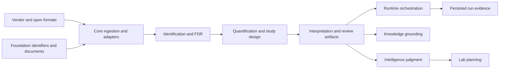

# Integration Seams

Core converts heterogeneous proteomics evidence into explicit scientific
contracts and review artifacts. Its integration seams preserve scientific
meaning while keeping execution, reference curation, recommendation authority,
and laboratory operations in separate packages.

## Major seams

| Seam | Producer obligation | Consumer obligation |
| --- | --- | --- |
| Foundation → core | provide stable identifiers, document envelopes, canonical serialization, outcomes, and provenance | add proteomics meaning without redefining shared primitives |
| External formats → ingestion | declare columns, score orientation, units, decoy policy, dialect, and source identity | retain field accounting, rejected rows, normalization loss, and provenance |
| Ingestion → identification | emit typed PSM and evidence records | preserve target-decoy labels, score semantics, ambiguity, and evidence level |
| Identification → quantification | provide accepted peptide and protein evidence with error-control context | retain contributors, grouping decisions, missingness, and inference assumptions |
| Study design → analysis | define samples, conditions, batches, replicates, contrasts, and validity | refuse analyses whose design does not support the requested claim |
| Core → runtime | provide validated program and workflow contracts through `interfaces/execution` | choose and operate backends without rewriting scientific rules |
| Core → knowledge | provide identifiers, claims, context, and provenance | ground them in curated references without changing measured evidence |
| Core → intelligence | provide reviewable evidence and analysis artifacts | rank or recommend while retaining uncertainty and refusals |
| Core/intelligence → lab | provide scientific rationale and bounded follow-up candidates | own readiness, controls, scheduling, handoff, and observed outcomes |

## Adapter boundary

Search adapters are loss-accounting boundaries, not import conveniences. Their
manifests describe result family, native columns, capabilities, score direction,
and decoy policy. Normalization reports must keep rejected input, unsupported
parameters, and source provenance visible. An adapter may translate a vendor
dialect into a core contract; it may not invent missing q-values, decoys, protein
references, or scientific confidence.

## Execution boundary

Core can define an execution request and validate a program before dispatch,
but runtime owns process control, providers, workspaces, retries, telemetry, and
artifact lifecycle. Core algorithms should remain usable in-process without a
runtime installation wherever their declared dependencies permit.

A seam change is complete only after both sides agree on identity, units,
versioning, rejected data, uncertainty, and provenance. Passing a Python object
across the boundary is not enough if either package must guess what its fields
mean.
