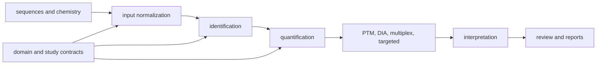

# Module Map

`bijux-proteomics-core` is the scientific computation layer. Its import package is `bijux_proteomics`, and its scope extends from raw-data contracts and sequence chemistry through identification, quantification, interpretation, and reviewable scientific outputs.

## Scientific families

| Family | Owned capability |
| --- | --- |
| `sequences`, `chemistry` | FASTA parsing, digestion policy, masses, isotopes, modifications, fragments, and modified-peptide contracts |
| `io`, `study` | mzML/MGF and table ingestion, normalized run bundles, metadata integrity, experimental design, and run QC |
| `identification` | Search-engine adapters, PSM and peptide evidence, protein inference, target-decoy FDR, contaminant review, and audit trails |
| `quantification` | Matrices, normalization, missingness, roll-up, statistics, batch effects, provenance, and differential analysis |
| `dia`, `multiplex`, `isotope_labeling` | Acquisition- and labeling-specific contracts, matrices, interference controls, and validation |
| `ptm`, `proteoforms` | Site localization, ambiguity, occupancy, regulation, crosstalk, evidence cards, and proteoform assembly |
| `targeted`, `panels` | Assay interference, assay QC, biomarker stability, target panels, and validation planning |
| `interpretation`, `biology` | Annotation mapping, enrichment, pathway and regulator inference, complexes, networks, and biological context |
| `review` | Claims, evidence graphs, belief summaries, explanations, structure reports, and reviewer-facing cards |
| `workflow`, `benchmarks` | Composable scientific pipelines, stable exports, case studies, challenge corpora, and acceptance evidence |

## Public entrypoints

The package root intentionally exposes five high-value operations: `DigestPolicy`, FASTA parsing, experimental-design parsing, normalized-run construction, and FDR audit-trail construction. Deeper capabilities are imported from their owned family rather than copied into a flat root namespace. The `bijux-proteomics` command enters through `interfaces.cli`; Python workflows can call the same scientific modules directly.

## Architectural boundary

Core owns scientific transformations and the evidence needed to review them. It does not own long-lived evidence memory, epistemic judgment, laboratory planning policy, or service execution. Those responsibilities belong to knowledge, intelligence, lab, and runtime respectively.
