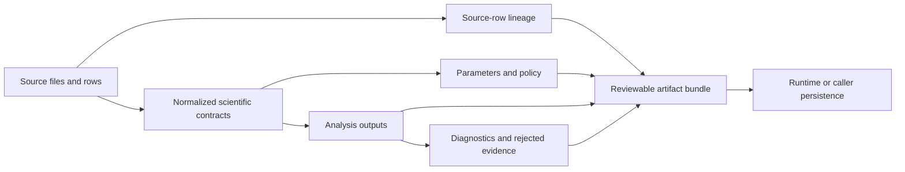

# State and Persistence

Core produces durable scientific artifacts but does not own operational storage. Its responsibility is to make every persisted table, bundle, card, and report self-describing enough to validate and interpret later.

## Durable scientific state

- normalized run bundles retain input identity and experimental design;
- identification artifacts retain scores, evidence level, target-decoy policy, grouping, ambiguity, and FDR;
- quantitative tables retain entity and sample keys, missingness, normalization, roll-up, units, statistics, and provenance;
- PTM, DIA, multiplex, isotope-labeling, proteoform, and targeted outputs retain their specialized contracts;
- review cards, evidence graphs, structure reports, and workflow exports retain links to scientific owners;
- rejected-evidence and issue tables preserve material excluded from primary results.

Stable ordering and atomic file replacement prevent nondeterministic diffs and partial publication. Output validation checks schema and cross-table coherence before an artifact set is treated as complete.

## Persistence boundary

Runtime or the calling application chooses filesystem, database, object-store, retention, and access-control policy. Core must not read hidden service state to interpret a result. A persisted artifact should remain scientifically understandable from its schema, provenance, parameters, and linked inputs even after the process that created it has ended.
