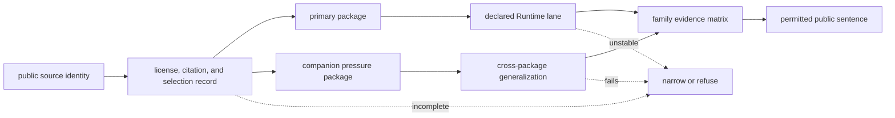

# Benchmark Assets

Benchmark evidence starts at public source identity and ends at the checked
packages used to constrain workflow-family claims.

The benchmark surface is no longer a thin example-data story. It is the public
scientific evidence root for flagship workflow language: source identity,
package manifests, lineage, freshness review, incompleteness notes, licensing
limits, and paired-package transfer pressure.

## What The Benchmark Surface Must Prove

A flagship benchmark package has to do more than contain files:

- identify the public source and its scientific role
- document how the packaged assets were selected and rebuilt
- expose enough evidence for an outsider to challenge the family sentence
- sit beside a companion pressure package so one convenient showcase does not
  dominate the release call

If the package is broad-looking but easy, stale, or isolated, it does not earn
flagship language.

## What Ships Here

- flagship public benchmark packages under
  `benchmark-assets/flagship-public-packages`
- source and citation manifests, generated boundaries, and rebuild
  instructions
- freshness, obsolescence, incompleteness, and licensing review surfaces
- family-specific lineage pages that explain why each current family sentence
  survives or narrows

## Benchmark Asset Classes

| asset class | what it gives reviewers | why it matters |
| --- | --- | --- |
| flagship public packages | primary outsider-readable evidence roots | the public sentence starts from real shipped materials |
| companion pressure packages | harder or narrowing comparison routes | one convenient benchmark cannot carry the whole release story |
| source identity and citation manifests | provenance and scientific role | reviewers can see what was packaged and why |
| rebuild and generated-boundary instructions | reproducibility discipline | benchmark packets stay inspectable rather than archival curiosities |
| freshness and incompleteness ledgers | evidence quality limits | weak or aging packets narrow public language at the evidence root |
| licensing and redistribution review | allowed public use | readers can trust that the benchmark surface is shippable, not only informative |

## Family Coverage

| family | benchmark strength today | key benchmark limiter | lineage page |
| --- | --- | --- | --- |
| `dda` | strong public package pair | strongest packet still routes into an import-backed runtime lane | [DDA Benchmark Lineage](https://bijux.io/bijux-proteomics/04-bijux-proteomics-core/foundation/dda-benchmark-lineage/) |
| `dia` | strong public package pair | library incompleteness still narrows broader transfer language | [DIA Benchmark Lineage](https://bijux.io/bijux-proteomics/04-bijux-proteomics-core/foundation/dia-benchmark-lineage/) |
| `lfq` | strong public package pair | cohort and missingness pressure still narrow broader public language | [LFQ Benchmark Lineage](https://bijux.io/bijux-proteomics/04-bijux-proteomics-core/foundation/lfq-benchmark-lineage/) |
| `multiplex` | real public package pair | current stress packet still collapses outsider-facing trust | [Multiplex Benchmark Lineage](https://bijux.io/bijux-proteomics/04-bijux-proteomics-core/foundation/multiplex-benchmark-lineage/) |
| `ptm` | strong public package pair | localization evidence still outruns downstream consequence confidence | [PTM Benchmark Lineage](https://bijux.io/bijux-proteomics/04-bijux-proteomics-core/foundation/ptm-benchmark-lineage/) |
| `targeted` | strong public package pair | calibration and interference still narrow broader certainty | [Targeted Benchmark Lineage](https://bijux.io/bijux-proteomics/04-bijux-proteomics-core/foundation/targeted-benchmark-lineage/) |

## From Public Source To Permitted Claim

The primary package demonstrates the declared scientific path under a known
set of conditions. The companion package changes a family-relevant condition:
engine, library, sparsity, channel stress, localization ambiguity, or
carryover. A family claim survives only when both packages remain traceable,
their declared lanes rerun, and the transfer report supports the requested
language.

## Audit A Benchmark Package

1. Resolve every source locator and confirm that the citation describes the
   scientific material actually packaged.
2. Compare the asset inventory with the generated boundary; copied source
   material and repository-derived outputs must not be conflated.
3. Rebuild the governed outputs and compare their declared stable artifacts.
4. Inspect freshness, incompleteness, and redistribution constraints before
   interpreting a successful run.
5. Run the companion package and read the family-transfer report before
   accepting any family-level sentence.

## Governed Benchmark Guarantees

- source identity and citation are reviewable separately from generated output
- package identity, artifact inventory, quality posture, and lifecycle posture
  are machine-readable
- every listed family pairs a primary package with a pressure package and a
  cross-package generalization record
- lineage, freshness, incompleteness, and licensing limits remain visible when
  later layers consume the package

These guarantees make the evidence inspectable. They do not guarantee that a
family passes its runtime, grounding, recommendation, or consequence bars.

## Continue The Audit

- Open [Flagship Public Benchmark Catalog](https://bijux.io/bijux-proteomics/04-bijux-proteomics-core/foundation/flagship-public-benchmark-catalog/)
  for the current benchmark package set.
- Open [Flagship Acceptance Bars](https://bijux.io/bijux-proteomics/04-bijux-proteomics-core/foundation/flagship-acceptance-bars/)
  for the criteria that distinguish flagship evidence from convenience.
- Open [Execution](https://bijux.io/bijux-proteomics/09-bijux-proteomics-runtime/execution-overview/)
  when the question becomes how these public evidence roots turn into rerun
  proof.
- Open [Decision Support](https://bijux.io/bijux-proteomics/01-bijux-proteomics/foundation/decision-support/)
  when the question becomes whether grounded contradiction or consequence
  pressure narrows the sentence further.

## Boundary

Benchmark lineage establishes where public scientific evidence starts and how
complete that evidence root is. Runtime trust, recommendation strength, and
laboratory consequence remain separate contracts.
