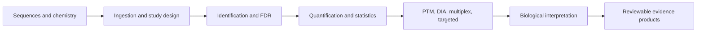

# Capability Map

`bijux-proteomics-core` owns the scientific transformations that turn proteomics inputs into reviewable analytical evidence. It spans the pipeline because sequence chemistry, ingestion, identification, quantification, and interpretation share scientific contracts that must remain coherent.

## Capability families

| Capability | Representative work |
| --- | --- |
| Molecular contracts | sequence digestion, amino-acid mass, modifications, isotopes, fragment ions, modified peptides, proteoforms |
| Input integrity | FASTA, mzML, MGF, search-engine output, experimental designs, metadata, tables, raw-signal evidence, source-row lineage |
| Identification | PSM features and rescoring, target-decoy analysis, peptide evidence, protein grouping and parsimony, contaminant audits, FDR trails |
| Quantification | matrix construction, normalization, missingness, roll-up, statistics, batch effects, differential analysis, provenance |
| Specialized proteomics | DIA matrices and transition QC, multiplex interference, SILAC, PTM localization and regulation, targeted assay review |
| Biological interpretation | annotations, enrichment, pathways, complexes, protein sets, regulators, networks, tissue and disease context |
| Review and validation | evidence graphs, claims, explanations, structure reports, benchmark corpora, pressure tests, stable exports |
| Composition | CLI and Python entrypoints, scientific workflows, case studies, and flagship result packages |

The package root remains narrow despite this breadth: five lazy exports cover digestion policy, FASTA parsing, experimental-design parsing, normalized-run construction, and FDR audit construction. Specialized APIs remain under the family that owns their semantics.

## Boundary

Core can calculate, validate, classify, and explain scientific results. It cannot turn those results into durable evidence authority, portfolio recommendation, laboratory approval, or service state. Knowledge, intelligence, lab, and runtime own those decisions respectively.
