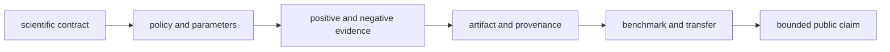

# Change principles

Core changes preserve scientific meaning before they optimize implementation.
Every change names the contract, policy, accepted and rejected behavior,
provenance, artifact effect, and evidence ceiling it affects.

## Classify the scientific change

| Change class | Required questions |
| --- | --- |
| parser or adapter | which producer/version/dialect, which fields, what is rejected, and what normalization is lossy? |
| domain model | which invariant or lifecycle meaning changes, and which consumers serialize it? |
| algorithm or score | what equation, orientation, units, boundaries, missingness, tolerance, and reference protect it? |
| threshold, FDR, or inference | which policy, strata, target/decoy meaning, ties, denominator, and sensitivity change? |
| quantification | which design, normalization, scale, contributors, batch, and zero/missing semantics apply? |
| workflow family | which primary, companion, negative, transfer, and acceptance evidence sets the ceiling? |
| artifact or public API | which schema, lineage, round trip, error, parity, and downstream reader change? |
| performance path | does serial equivalence, deterministic ordering, failure behavior, and artifact identity remain? |

## Durable rules

- reject or report malformed and unsupported input; never discard it silently;
- keep imported external-engine results visibly distinct from native
  computation;
- serialize policy and provenance with reviewable results;
- treat missing, censored, filtered, failed, and zero as distinct when the
  scientific contract distinguishes them;
- require independent reference evidence for a new scientific claim;
- evaluate DDA, DIA, LFQ, multiplex, PTM, and targeted status independently;
- keep execution, evidence custody, recommendation policy, and laboratory
  authority in their owning packages; and
- narrow public language when proof does not widen with behavior.

## Compatibility and history

Changing field names, defaults, ordering, error codes, rejection counts, or
policy metadata can break scientific interpretation even when the Python call
still succeeds. Preserve old fixtures and provide an explicit compatibility
decision. A new result must not retroactively alter the meaning of a retained
artifact.
