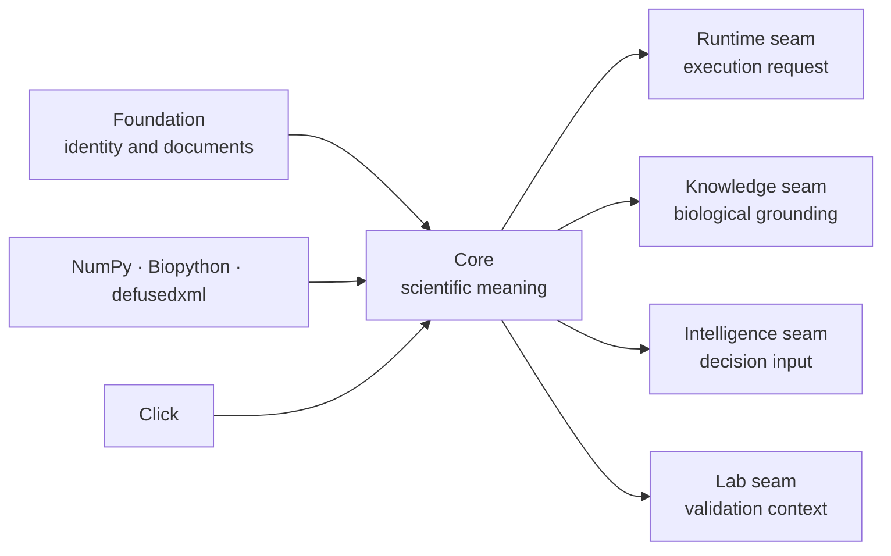

# Dependencies and adjacencies

Core depends on Foundation for portable identity and document behavior, and on
scientific libraries for numerical, sequence, XML, and command-line work. It
also contains narrow integration seams that exchange records with Runtime,
Knowledge, Intelligence, and Lab. Those seams compose an evidence chain; they
do not make Core the owner of execution, evidence custody, decisions, or
laboratory operations.

## Dependency shape

The left-hand edges provide implementation prerequisites. The right-hand edges
are governed integration seams. A seam may import a public record from its owner
for composition, but Core must remain usable for scientific work that does not
need that downstream integration.

## Direct prerequisites

| Dependency | Core use | Constraint |
| --- | --- | --- |
| Foundation | `JsonModel`, identifiers, document schemas, canonical representation | shared representation must not acquire scientific policy |
| NumPy | numerical arrays and calculations | array behavior must be normalized before it enters a durable public record |
| Biopython | established sequence and proteomics primitives | adapter behavior and information loss remain explicit in Core contracts |
| defusedxml | defensive XML parsing | safe parsing does not establish mzML or scientific validity |
| Click | scientific CLI assembly | command handlers call domain owners rather than implement algorithms |
| Loguru | diagnostics | logs do not replace typed result, rejection, or provenance records |

## Cross-package seams

| Neighbor | Legitimate Core handoff | Ownership that cannot move into Core |
| --- | --- | --- |
| Runtime | validated workflow request, expected artifacts, scientific acceptance policy | provider selection, state, retry, checkpoint, transport, and replay |
| Knowledge | protein/pathway resolution input and evidence references | source curation, contradiction state, sufficiency, and evidence memory |
| Intelligence | scientific result and bounded acceptance evidence | ranking, scenario policy, regret, confidence, and recommendation posture |
| Lab | scientific QC, validation intent, and measurement requirements | readiness, scheduling, custody, observation, and consequence |

Several integrated report and flagship acceptance paths touch more than one
neighbor. Their job is to preserve references across owners, not to flatten the
records into a new Core-owned truth object.

## Dependency review

Before adding or widening an edge, answer:

1. can the scientific contract remain valid without the downstream package?
2. is Core importing a public record rather than a neighbor’s internal model?
3. does the resulting artifact retain the neighbor’s identity and authority?
4. can missing optional integration return an explicit result or refusal?
5. is the same behavior reachable without a circular product dependency?

If the proposed edge lets a Core calculation choose a provider, reconcile a
contradiction, rank an action, or authorize lab work, route the behavior to the
owning package instead.

See [scientific package map](package-overview.md) for domain ownership and
[dependency governance](../quality/dependency-governance.md) for validation
required when package or third-party dependencies change.
