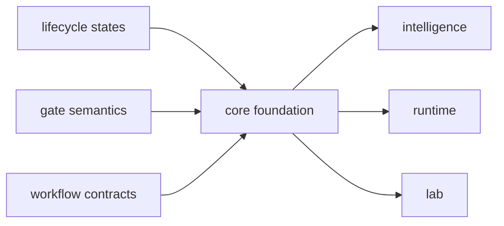

# Foundation

The core foundation section is where the repository names its durable
scientific law: workflow contracts, lifecycle transitions, review gates,
runtime-agnostic request shapes, and benchmark acceptance logic. If a page here
needs recommendation posture or operator transport to justify itself, the
boundary is already drifting.

This section now carries far more real scientific weight than an abstract
workflow charter. Public benchmark evidence, workflow-family trust, and release
scrutiny all depend on core continuing to state runtime-agnostic workflow
contracts, benchmark-acceptance bars, and lifecycle transitions in terms that
remain inspectable outside execution code.

## What This Section Protects

- one canonical workflow grammar before downstream packages add policy or
  transport
- review-gate and lifecycle truth that stays inspectable outside runtime code
- scientific contracts that remain distinct from evidence memory and lab burden

## What Makes This Section Scientifically Heavy

- it names the repository's scientific law before downstream judgment begins
- benchmark-backed workflow families must clear benchmark-acceptance scrutiny
  here before they earn broader trust language
- runtime, knowledge, intelligence, and lab all inherit these lifecycle
  transitions and workflow contracts before they add local owner logic

## Start With

- Ownership and scope:
  open [Package Overview](https://bijux.io/bijux-proteomics/04-bijux-proteomics-core/foundation/package-overview/),
  [Ownership Boundary](https://bijux.io/bijux-proteomics/04-bijux-proteomics-core/foundation/ownership-boundary/),
  [This Package Does Not Own](https://bijux.io/bijux-proteomics/04-bijux-proteomics-core/this-package-does-not-own/),
  and [Scope and Non-Goals](https://bijux.io/bijux-proteomics/04-bijux-proteomics-core/foundation/scope-and-non-goals/)
  when the question is whether a scientific workflow concern really belongs in
  core.
- Benchmark evidence:
  open [Benchmark Assets](https://bijux.io/bijux-proteomics/04-bijux-proteomics-core/foundation/benchmark-assets/),
  [Flagship Public Benchmark Catalog](https://bijux.io/bijux-proteomics/04-bijux-proteomics-core/foundation/flagship-public-benchmark-catalog/),
  [Flagship Benchmark Assets](https://bijux.io/bijux-proteomics/04-bijux-proteomics-core/foundation/flagship-benchmark-assets/),
  and [Benchmark Asset Audit](https://bijux.io/bijux-proteomics/04-bijux-proteomics-core/foundation/benchmark-asset-audit/)
  when the question is what public benchmark roots exist and how they were
  governed into the repository.
- Workflow trust:
  open [Benchmark Freshness Review](https://bijux.io/bijux-proteomics/04-bijux-proteomics-core/foundation/benchmark-freshness-review/),
  [Benchmark Incompleteness Ledger](https://bijux.io/bijux-proteomics/04-bijux-proteomics-core/foundation/benchmark-incompleteness-ledger/),
  [Benchmark Flagship Status](https://bijux.io/bijux-proteomics/04-bijux-proteomics-core/foundation/benchmark-flagship-status/),
  and [Flagship Acceptance Bars](https://bijux.io/bijux-proteomics/04-bijux-proteomics-core/foundation/flagship-acceptance-bars/)
  when the question is whether benchmark evidence still earns a public
  workflow sentence.
- Family transfer:
  open the family lineage pages plus the
  [Flagship Challenge Corpus Catalog](https://bijux.io/bijux-proteomics/04-bijux-proteomics-core/foundation/flagship-challenge-corpus-catalog/)
  when the dispute is whether one workflow family survives blinded holdouts,
  perturbations, and companion-package generalization.

## Section Pages

- [Package Overview](https://bijux.io/bijux-proteomics/04-bijux-proteomics-core/foundation/package-overview/)
- [Scope and Non-Goals](https://bijux.io/bijux-proteomics/04-bijux-proteomics-core/foundation/scope-and-non-goals/)
- [Ownership Boundary](https://bijux.io/bijux-proteomics/04-bijux-proteomics-core/foundation/ownership-boundary/)
- [This Package Does Not Own](https://bijux.io/bijux-proteomics/04-bijux-proteomics-core/this-package-does-not-own/)
- [Capability Map](https://bijux.io/bijux-proteomics/04-bijux-proteomics-core/foundation/capability-map/)
- [Flagship Public Benchmark Catalog](https://bijux.io/bijux-proteomics/04-bijux-proteomics-core/foundation/flagship-public-benchmark-catalog/)
- [Flagship Benchmark Assets](https://bijux.io/bijux-proteomics/04-bijux-proteomics-core/foundation/flagship-benchmark-assets/)
- [Benchmark Asset Audit](https://bijux.io/bijux-proteomics/04-bijux-proteomics-core/foundation/benchmark-asset-audit/)
- [Benchmark Freshness Review](https://bijux.io/bijux-proteomics/04-bijux-proteomics-core/foundation/benchmark-freshness-review/)
- [Benchmark Licensing and Redistribution](https://bijux.io/bijux-proteomics/04-bijux-proteomics-core/foundation/benchmark-licensing-and-redistribution/)
- [Benchmark Incompleteness Ledger](https://bijux.io/bijux-proteomics/04-bijux-proteomics-core/foundation/benchmark-incompleteness-ledger/)
- [Benchmark Flagship Status](https://bijux.io/bijux-proteomics/04-bijux-proteomics-core/foundation/benchmark-flagship-status/)
- [DDA Benchmark Lineage](https://bijux.io/bijux-proteomics/04-bijux-proteomics-core/foundation/dda-benchmark-lineage/)
- [DIA Benchmark Lineage](https://bijux.io/bijux-proteomics/04-bijux-proteomics-core/foundation/dia-benchmark-lineage/)
- [LFQ Benchmark Lineage](https://bijux.io/bijux-proteomics/04-bijux-proteomics-core/foundation/lfq-benchmark-lineage/)
- [Multiplex Benchmark Lineage](https://bijux.io/bijux-proteomics/04-bijux-proteomics-core/foundation/multiplex-benchmark-lineage/)
- [PTM Benchmark Lineage](https://bijux.io/bijux-proteomics/04-bijux-proteomics-core/foundation/ptm-benchmark-lineage/)
- [Targeted Benchmark Lineage](https://bijux.io/bijux-proteomics/04-bijux-proteomics-core/foundation/targeted-benchmark-lineage/)
- [Flagship Challenge Corpus Catalog](https://bijux.io/bijux-proteomics/04-bijux-proteomics-core/foundation/flagship-challenge-corpus-catalog/)
- [Flagship Acceptance Bars](https://bijux.io/bijux-proteomics/04-bijux-proteomics-core/foundation/flagship-acceptance-bars/)
- [Dependencies and Adjacencies](https://bijux.io/bijux-proteomics/04-bijux-proteomics-core/foundation/dependencies-and-adjacencies/)
- [Repository Fit](https://bijux.io/bijux-proteomics/04-bijux-proteomics-core/foundation/repository-fit/)
- [Lifecycle Overview](https://bijux.io/bijux-proteomics/04-bijux-proteomics-core/foundation/lifecycle-overview/)
- [Domain Language](https://bijux.io/bijux-proteomics/04-bijux-proteomics-core/foundation/domain-language/)
- [Change Principles](https://bijux.io/bijux-proteomics/04-bijux-proteomics-core/foundation/change-principles/)

## What This Section Settles

- whether a rule changes canonical scientific workflow truth or only downstream
  interpretation
- which benchmark-acceptance and lifecycle surfaces are still owned here
- when a proposed change is really evidence policy, runtime delivery, or lab
  consequence and should leave this package

## Strongest Core Proof

- start with
  [Benchmark Assets](https://bijux.io/bijux-proteomics/04-bijux-proteomics-core/foundation/benchmark-assets/)
  when the question is whether the repository has real public scientific roots
- continue to
  [Flagship Acceptance Bars](https://bijux.io/bijux-proteomics/04-bijux-proteomics-core/foundation/flagship-acceptance-bars/)
  when the dispute is whether a family still earns benchmark-backed trust
- open
  [This Package Does Not Own](https://bijux.io/bijux-proteomics/04-bijux-proteomics-core/this-package-does-not-own/)
  when a proposal is trying to turn scientific law into evidence policy,
  recommendation posture, or operator transport

## First Proof Check

- `packages/bijux-proteomics-core/src/bijux_proteomics`
- `packages/bijux-proteomics-core/tests`
- neighboring handbooks once the change crosses the local boundary

## Neighbors

- Open [bijux-proteomics-foundation](https://bijux.io/bijux-proteomics/03-bijux-proteomics-foundation/)
  when the question leaves program contracts, lifecycle rules, and gate semantics.
- Open [bijux-proteomics-intelligence](https://bijux.io/bijux-proteomics/05-bijux-proteomics-intelligence/)
  when the issue is clearly outside this package's local role.
