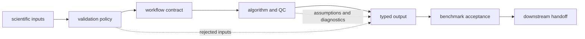
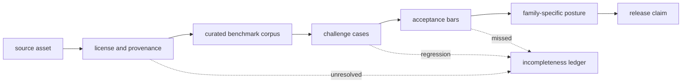

# Scientific foundations

Core defines proteomics contracts that remain valid regardless of how they are
executed or interpreted downstream. It owns scientific input validation,
workflow request shapes, algorithmic semantics, QC, benchmark acceptance, and
typed scientific outputs. Runtime may execute a Core request; Knowledge may
ground its claims; Intelligence may rank actions from it; Lab may test its
consequences. None of those packages can redefine the original scientific
contract.

This is scientific law expressed as runtime-agnostic workflow contracts. The
law covers admissible inputs, algorithms and assumptions, scientific refusals,
typed outputs, lifecycle transitions, and benchmark-acceptance criteria. It is
portable across an in-process call, a queued run, or a later replay because the
execution mechanism cannot change its meaning.

## Find the scientific owner

| Concern | Core owner surface | Begin with |
| --- | --- | --- |
| package scope and domain boundaries | package foundation | [Package overview](package-overview.md) and [ownership boundary](ownership-boundary.md) |
| sequence, chemistry, spectra, identification, inference, or quantification | domain modules and typed contracts | [Capability map](capability-map.md) |
| benchmark provenance and redistribution | benchmark asset governance | [Benchmark assets](benchmark-assets.md) and [licensing](benchmark-licensing-and-redistribution.md) |
| workflow-family validation | lineage, corpus, and acceptance records | the family lineage and [acceptance bars](flagship-acceptance-bars.md) |
| execution state, provider selection, or replay | Runtime | [Runtime execution boundary](../../09-bijux-proteomics-runtime/runtime-execution-boundary.md) |
| evidence truth or contradiction | Knowledge | [Knowledge handbook](../../06-bijux-proteomics-knowledge/index.md) |
| ranking or recommendation posture | Intelligence | [Intelligence handbook](../../05-bijux-proteomics-intelligence/index.md) |
| assay readiness or observed outcome | Lab | [Lab handbook](../../07-bijux-proteomics-lab/index.md) |

[This package does not own](../this-package-does-not-own.md) gives concrete
counterexamples for boundaries that are easy to blur.

## Workflow contract anatomy

A reviewable workflow contract identifies:

1. accepted input formats, identifier rules, and validation strictness;
2. active scientific policies and defaults;
3. algorithm or adapter identity, including external-engine provenance;
4. expected outputs, rejected-input records, diagnostics, and QC;
5. refusal and failure conditions;
6. benchmark corpus, acceptance criteria, and transfer limits;
7. the typed handoff to execution or downstream interpretation.

The contract does not promise that all inputs will succeed. Refusal is the
correct result when the requested capability, evidence, or scientific premise
is unavailable.

## From asset to acceptance

The [public benchmark catalog](flagship-public-benchmark-catalog.md) lists the
roots intended for external inspection. [Flagship benchmark assets](flagship-benchmark-assets.md)
records the governed bundle, while the [asset audit](benchmark-asset-audit.md)
and [freshness review](benchmark-freshness-review.md) check provenance and age.
Missing, restricted, or weak material remains visible in the
[incompleteness ledger](benchmark-incompleteness-ledger.md).

## Audit the benchmark root

Start with the question the claim depends on, then open the corresponding
evidence surface:

| Review question | Canonical evidence |
| --- | --- |
| can an outsider find every primary and companion source? | [Benchmark Asset Audit](benchmark-asset-audit.md) |
| may the checked material be redistributed and reused? | [Benchmark Licensing and Redistribution](benchmark-licensing-and-redistribution.md) |
| which missing assets or transfer zones narrow the claim? | [Benchmark Incompleteness Ledger](benchmark-incompleteness-ledger.md) |
| is the checked corpus current relative to its source? | [Benchmark Freshness Review](benchmark-freshness-review.md) |
| what posture does the complete governed evidence support? | [Benchmark Flagship Status](benchmark-flagship-status.md) |
| which measurable conditions determine acceptance? | [Flagship Acceptance Bars](flagship-acceptance-bars.md) |

Family lineage is the bridge between those repository-wide controls and a
specific scientific claim: [DDA Benchmark Lineage](dda-benchmark-lineage.md),
[DIA Benchmark Lineage](dia-benchmark-lineage.md), [LFQ Benchmark Lineage](lfq-benchmark-lineage.md),
[Multiplex Benchmark Lineage](multiplex-benchmark-lineage.md), [PTM Benchmark Lineage](ptm-benchmark-lineage.md),
and [Targeted Benchmark Lineage](targeted-benchmark-lineage.md). A family is
not strengthened by evidence recorded only in another family.

## Workflow-family evidence

Each family has its own lineage because validation cannot be inherited merely
from sharing a package:

- [DDA](dda-benchmark-lineage.md) covers search, PSM review, FDR, inference, and
  downstream artifacts under its declared corpus.
- [DIA](dia-benchmark-lineage.md) covers library and import paths, run QC,
  quantification, and family-specific comparisons.
- [LFQ](lfq-benchmark-lineage.md) covers normalization, missingness,
  reproducibility, and bounded review-grade claims.
- [PTM](ptm-benchmark-lineage.md) covers localization, ambiguity, and
  modification-specific review.
- [Targeted](targeted-benchmark-lineage.md) covers panels, transitions,
  feasibility, and targeted evidence.
- [Multiplex](multiplex-benchmark-lineage.md) records the current internal
  support boundary rather than borrowing maturity from other families.

The [challenge corpus catalog](flagship-challenge-corpus-catalog.md) exposes
holdouts, perturbations, and cross-package cases. The
[benchmark status](benchmark-flagship-status.md) summarizes the current posture
without replacing the underlying lineage and acceptance evidence.

## Benchmark-acceptance and transfer

An acceptance bar states a measurable condition and the consequence of missing
it. Passing the in-distribution corpus is necessary but not sufficient for a
broad claim. Review also considers:

- blinded or held-out cases;
- changes in instrument, acquisition, search engine, and preprocessing;
- threshold and parameter sensitivity;
- incomplete, ambiguous, and adversarial inputs;
- transfer into Runtime, Knowledge, Intelligence, and Lab artifacts;
- whether failure and refusal remain visible after each handoff.

The result is a bounded workflow-family posture, not a universal statement
about proteomics.

## This Package Does Not Own

Core does not own provider discovery, retries, scheduling, run custody, or
artifact transport; those belong to Runtime. It does not own evidence truth,
recommendation posture, or assay authorization either. Those authorities remain
with Knowledge, Intelligence, and Lab. Core supplies the scientific request,
result, refusal, and benchmark-acceptance law that each downstream package must
preserve. The [boundary examples](../this-package-does-not-own.md) make these
handoffs concrete.

## Package evolution

The [scope and non-goals](scope-and-non-goals.md) protect Core from absorbing
execution and decision policy. [Dependencies and adjacencies](dependencies-and-adjacencies.md)
govern imports, [domain language](domain-language.md) stabilizes scientific
terms, and [change principles](change-principles.md) require contract and
benchmark evidence when behavior moves. [Lifecycle overview](lifecycle-overview.md)
connects workflow states and review gates without assigning operator transport
to Core.
