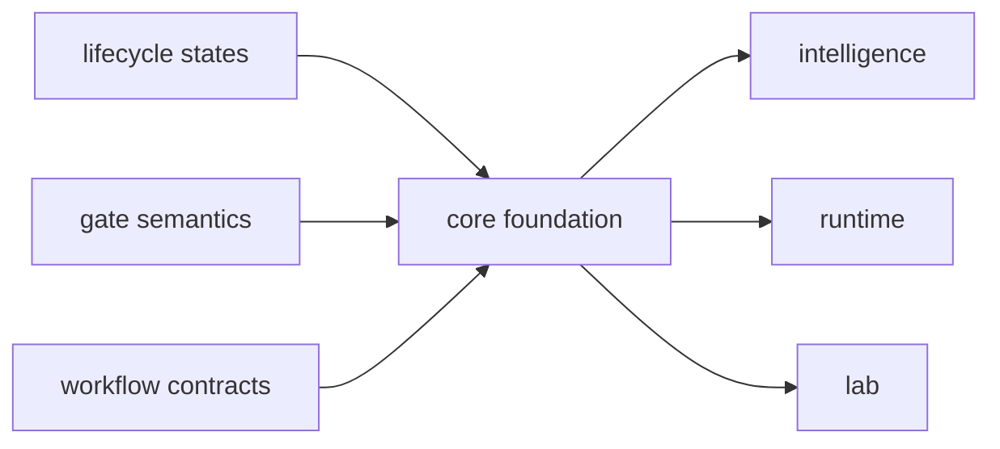

# Foundation

The foundation section explains the durable role of `bijux-proteomics-core` before it
explains implementation detail. Use it to resolve why durable workflow rules belong here before evidence, scoring, or execution layers act on them.

## What This Section Protects

- one durable grammar for workflows before downstream packages optimize around
  it
- gate semantics that remain reviewable instead of dissolving into code paths
- lifecycle discipline that survives changes in policy or execution tooling

## Start With

- Open [Package Overview](https://bijux.io/bijux-proteomics/04-bijux-proteomics-core/foundation/package-overview/) for the shortest statement of
  the package role.
- Open [Ownership Boundary](https://bijux.io/bijux-proteomics/04-bijux-proteomics-core/foundation/ownership-boundary/) when the question is
  whether a change belongs here or in a neighbor.
- Open [Scope and Non-Goals](https://bijux.io/bijux-proteomics/04-bijux-proteomics-core/foundation/scope-and-non-goals/) when a proposed change
  risks broadening the package.
- Open [Capability Map](https://bijux.io/bijux-proteomics/04-bijux-proteomics-core/foundation/capability-map/) when you need the concrete work
  the package is allowed to do.
- Open [Flagship Public Benchmark Catalog](https://bijux.io/bijux-proteomics/04-bijux-proteomics-core/foundation/flagship-public-benchmark-catalog/)
  when you need the current public package roots and artifact contracts across
  the flagship workflow families.
- Open [Flagship Benchmark Assets](https://bijux.io/bijux-proteomics/04-bijux-proteomics-core/foundation/flagship-benchmark-assets/)
  when you need the copied-source contract, rebuild command, citation manifest,
  freshness report, and obsolescence audit behind those roots.
- Open [Benchmark Asset Audit](https://bijux.io/bijux-proteomics/04-bijux-proteomics-core/foundation/benchmark-asset-audit/)
  when you need every primary and companion benchmark root re-audited for raw
  source, checksum, extraction step, derived review path, and owning rebuild
  command.
- Open the family lineage pages when the dispute is whether one workflow family
  still holds together across both its primary flagship package and its
  companion generalization package.
- Open [Benchmark Licensing and Redistribution](https://bijux.io/bijux-proteomics/04-bijux-proteomics-core/foundation/benchmark-licensing-and-redistribution/)
  when the question is what the repository redistributes as governed evidence
  versus what remains only a public reference or external-engine context.
- Open [Benchmark Incompleteness Ledger](https://bijux.io/bijux-proteomics/04-bijux-proteomics-core/foundation/benchmark-incompleteness-ledger/)
  when you need the live blockers, realism limits, non-transfer zones, and
  failure conditions that still cap benchmark trust.
- Open [Benchmark Flagship Status](https://bijux.io/bijux-proteomics/04-bijux-proteomics-core/foundation/benchmark-flagship-status/)
  when the question is whether a package root still deserves flagship naming or
  should be treated only as a companion or internal-support surface.
- Open [Flagship Challenge Corpus Catalog](https://bijux.io/bijux-proteomics/04-bijux-proteomics-core/foundation/flagship-challenge-corpus-catalog/)
  when you need the blinded holdouts and perturbation roots that deliberately
  try to break those benchmark claims.
- Open [Flagship Acceptance Bars](https://bijux.io/bijux-proteomics/04-bijux-proteomics-core/foundation/flagship-acceptance-bars/)
  when you need the exact thresholds, dashboard, history ledger, and rationale
  dossier that decide whether release trust is still earned.

## Section Pages

- [Package Overview](https://bijux.io/bijux-proteomics/04-bijux-proteomics-core/foundation/package-overview/)
- [Scope and Non-Goals](https://bijux.io/bijux-proteomics/04-bijux-proteomics-core/foundation/scope-and-non-goals/)
- [Ownership Boundary](https://bijux.io/bijux-proteomics/04-bijux-proteomics-core/foundation/ownership-boundary/)
- [Capability Map](https://bijux.io/bijux-proteomics/04-bijux-proteomics-core/foundation/capability-map/)
- [Flagship Public Benchmark Catalog](https://bijux.io/bijux-proteomics/04-bijux-proteomics-core/foundation/flagship-public-benchmark-catalog/)
- [Flagship Benchmark Assets](https://bijux.io/bijux-proteomics/04-bijux-proteomics-core/foundation/flagship-benchmark-assets/)
- [Benchmark Asset Audit](https://bijux.io/bijux-proteomics/04-bijux-proteomics-core/foundation/benchmark-asset-audit/)
- [Benchmark Licensing and Redistribution](https://bijux.io/bijux-proteomics/04-bijux-proteomics-core/foundation/benchmark-licensing-and-redistribution/)
- [Benchmark Incompleteness Ledger](https://bijux.io/bijux-proteomics/04-bijux-proteomics-core/foundation/benchmark-incompleteness-ledger/)
- [Benchmark Flagship Status](https://bijux.io/bijux-proteomics/04-bijux-proteomics-core/foundation/benchmark-flagship-status/)
- [DDA Benchmark Lineage](https://bijux.io/bijux-proteomics/04-bijux-proteomics-core/foundation/dda-benchmark-lineage/)
- [DIA Benchmark Lineage](https://bijux.io/bijux-proteomics/04-bijux-proteomics-core/foundation/dia-benchmark-lineage/)
- [LFQ Benchmark Lineage](https://bijux.io/bijux-proteomics/04-bijux-proteomics-core/foundation/lfq-benchmark-lineage/)
- [Multiplex Benchmark Lineage](https://bijux.io/bijux-proteomics/04-bijux-proteomics-core/foundation/multiplex-benchmark-lineage/)
- [PTM Benchmark Lineage](https://bijux.io/bijux-proteomics/04-bijux-proteomics-core/foundation/ptm-benchmark-lineage/)
- [Targeted Benchmark Lineage](https://bijux.io/bijux-proteomics/04-bijux-proteomics-core/foundation/targeted-benchmark-lineage/)
- [Flagship Challenge Corpus Catalog](https://bijux.io/bijux-proteomics/04-bijux-proteomics-core/foundation/flagship-challenge-corpus-catalog/)
- [Flagship Acceptance Bars](https://bijux.io/bijux-proteomics/04-bijux-proteomics-core/foundation/flagship-acceptance-bars/)
- [Dependencies and Adjacencies](https://bijux.io/bijux-proteomics/04-bijux-proteomics-core/foundation/dependencies-and-adjacencies/)
- [Repository Fit](https://bijux.io/bijux-proteomics/04-bijux-proteomics-core/foundation/repository-fit/)
- [Lifecycle Overview](https://bijux.io/bijux-proteomics/04-bijux-proteomics-core/foundation/lifecycle-overview/)
- [Domain Language](https://bijux.io/bijux-proteomics/04-bijux-proteomics-core/foundation/domain-language/)
- [Change Principles](https://bijux.io/bijux-proteomics/04-bijux-proteomics-core/foundation/change-principles/)

## What This Section Settles

- when a rule is foundational enough to belong in core
- how much downstream freedom exists once lifecycle and gate contracts are set
- when a proposed change is really policy or execution and should leave this
  package

## First Proof Check

- `packages/bijux-proteomics-core/src/bijux_proteomics`
- `packages/bijux-proteomics-core/tests`
- neighboring handbooks once the change crosses the local boundary

## Neighbors

- Open [bijux-proteomics-foundation](https://bijux.io/bijux-proteomics/03-bijux-proteomics-foundation/)
  when the question leaves program contracts, lifecycle rules, and gate semantics.
- Open [bijux-proteomics-intelligence](https://bijux.io/bijux-proteomics/05-bijux-proteomics-intelligence/)
  when the issue is clearly outside this package's local role.
