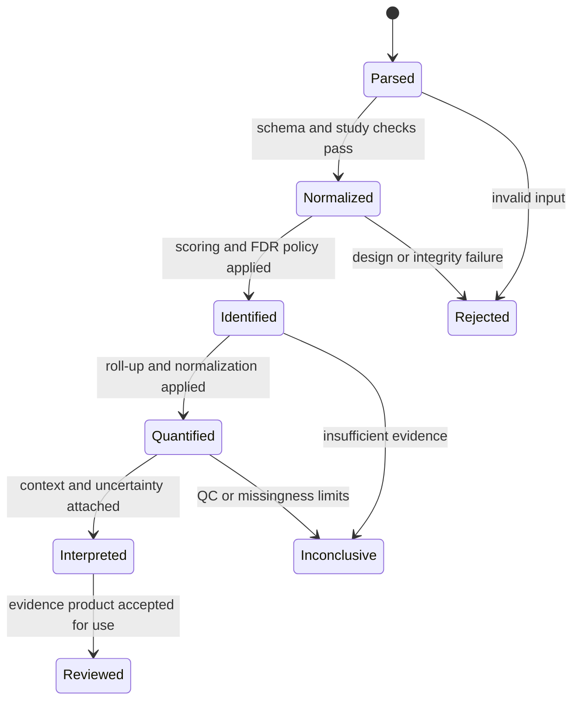

# Lifecycle Overview

A core result moves through scientific states, not merely function calls. Each transition adds interpretation while retaining the identity, exclusions, parameters, and provenance needed to review the result.

## Input lifecycle

Parsers convert external formats into typed records while retaining source-row or source-file lineage. Validation separates malformed input from scientifically unsuitable input. Normalized run bundles bind spectra, design metadata, identifiers, and integrity findings into a comparable analytical starting point.

## Evidence lifecycle

Identification attaches search provenance, scores, target-decoy decisions, peptide evidence, protein grouping, ambiguity, and FDR. Quantification then records matrix construction, normalization, missingness, roll-up, statistics, and QC. Specialized analyses add acquisition, labeling, modification, proteoform, or targeted-assay semantics without erasing those upstream decisions.

Interpretation maps results to biological context and produces review surfaces. It does not promote the output into durable knowledge; consumers decide whether the retained evidence and limitations are fit for that later purpose.

## Re-execution

Stable input contracts, explicit policies, deterministic ordering, atomic output writes, and retained provenance make reruns comparable. A code or policy change that alters scientific output requires a visible contract or result change. Runtime may schedule the computation, but it cannot redefine these scientific transitions.
