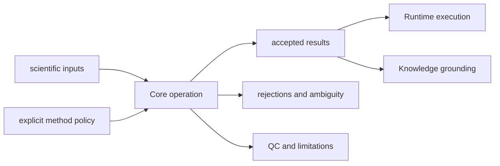

# Ownership Boundary

Core owns deterministic proteomics computation and the scientific contracts
needed to review it. Inputs, policies, accepted and rejected material,
diagnostics, ambiguity, and limitations must remain visible independently of
the caller or execution environment.

## Owned Scientific Surfaces

| Surface | Core authority |
| --- | --- |
| formats and intake | FASTA, spectra, mzML, tables, search-engine exports, normalized bundles |
| sequence and chemistry | digestion, modifications, masses, fragments, target-decoy construction |
| identification | PSM normalization, score orientation, FDR, protein inference, ambiguity |
| quantification | normalization, missingness, differential analysis, protein and peptide summaries |
| workflow families | DDA, DIA, LFQ, multiplex, PTM, targeted scientific contracts |
| interpretation | enrichment and biological-context computations over explicit inputs |
| benchmarks | fixtures, reference cases, comparators, acceptance, challenge corpora |
| scientific artifacts | typed reports, QC, rejected rows, policy, provenance, limitations |

## Refused Ownership

Core does not own process state, providers, retries, scheduling, replay,
evidence custody, citation truth, recommendation policy, laboratory readiness,
or repository governance. A Core result can be executed by Runtime, grounded by
Knowledge, judged by Intelligence, and acted on by Lab without transferring
those authorities into the scientific operation.

## Placement Test

Keep a change in Core when the same scientific inputs and policy should produce
the same reviewable result regardless of process environment. Move it to
Runtime when it concerns when, where, or how work executes; to Knowledge when
it concerns claim support; to Intelligence when it selects or recommends; and
to Lab when it concerns practical follow-up or outcomes.

Scientific convenience is not enough. A helper belongs here only when it
preserves an owned scientific invariant and exposes the evidence required to
challenge it.
