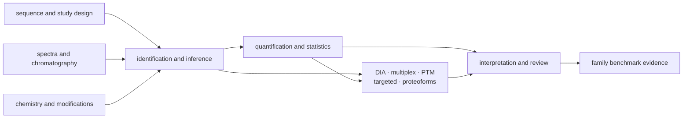
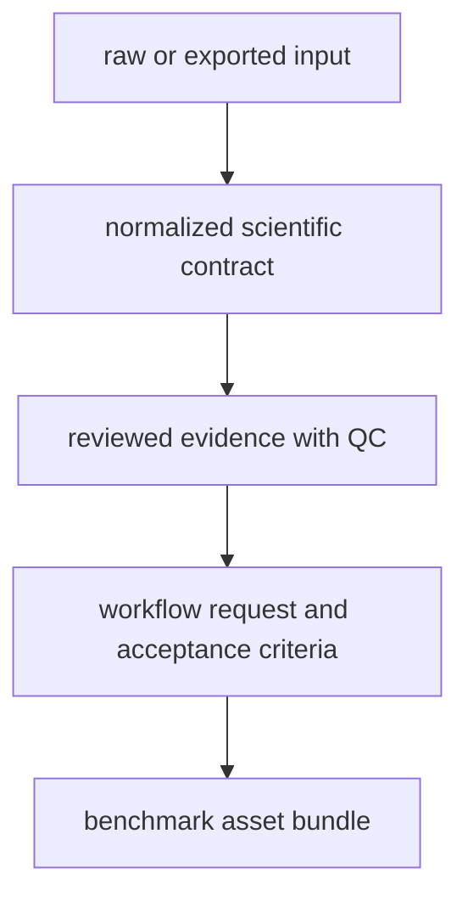

# Scientific package map

The core source tree is grouped by scientific responsibility. Domain modules
own models and algorithms; interface modules assemble those capabilities into
CLI operations and portable artifacts; workflow modules connect validated
steps without moving their scientific ownership.

## From molecules to evidence

The arrows describe evidence dependencies, not a mandatory monolithic run.
Targeted validation can begin from transition evidence; PTM review can retain
site-localization ambiguity without waiting for pathway interpretation; a
benchmark can pressure one owned contract without exercising every module.

### Sequences and experimental context

`sequences` handles FASTA records, validation, decoys, contaminants, digestion,
peptide indexing, and sequence-derived properties. `study` models sample sheets,
design factors, contrasts, feasibility, power, and repair suggestions. `domain`
holds program, target, assay, lifecycle, review, constraint, and semantic-ID
contracts used across workflows.

### Chemistry and signal

`chemistry` owns amino-acid masses, modified-peptide parsing and resolution,
fragment-ion contracts, isotope envelopes, adduct annotation, isotope labeling,
and theoretical references. `io` owns supported file and table boundaries,
including spectra, mzML, chromatography, raw-source lineage, normalized run
bundles, and format conversion.

These layers preserve the difference between a theoretical chemical value, an
instrument observation, and an imported search-engine assertion.

### Identification and protein inference

`identification` normalizes search results from Comet, DIA-NN, FragPipe,
MaxQuant, OpenMS, Sage, and Spectronaut. It owns PSM contracts, score and FDR
review, calibration, contaminant audit, peptide evidence, protein grouping,
parsimony, ambiguity, and inference benchmarks. Adapter-specific information
loss is recorded instead of silently coerced into a richer canonical model.

### Quantification and specialized analysis

`quantification` covers peptide and protein matrices, LFQ, normalization,
missingness, differential analysis, uncertainty, reproducibility, and
provenance. `dia` adds precursor/protein matrices, library coverage, run QC,
and transition QC. `ptm`, `proteoforms`, `multiplex`, `isotope_labeling`, and
`targeted` own their specialized evidence and review semantics.

### Interpretation and review

`interpretation` connects governed quantitative results to contrasts,
pathways, biological context, contaminants, PTMs, and structures. `review`
produces result manifests, evidence cards, explanations, search and query
surfaces, interactive bundles, biological reports, and trust material.
`lab` contains scientific QC and validation-planning contracts that precede the
operational assay ownership of `bijux-proteomics-lab`.

### Benchmarks and workflows

`benchmarks` owns corpora, public case studies, challenge assets, generalization
reports, performance evidence, and flagship acceptance. `workflow` defines
runtime-agnostic requests, validation, scientific gates, report assembly, and
family-specific routes. The workflow layer composes domain owners; it must not
become an alternative location for their algorithms.

## Artifact progression

Every progression should retain source lineage, declared normalization,
thresholds, reason codes, and failure state. A downstream summary is not a
replacement for the normalized or reviewed artifact that supports it.

## Extension rules

- Add a new file adapter under the scientific format or identification owner,
  and make information loss explicit.
- Add a new algorithm beside the domain contract it implements, not inside a
  CLI handler or report renderer.
- Add a workflow only after its input, output, failure, and acceptance
  contracts are stable.
- Add a public benchmark only with provenance, licensing, freshness, challenge
  coverage, and family-specific acceptance evidence.
- Keep execution providers, checkpoints, and replay in runtime; keep evidence
  reconciliation and recommendation policy in their owning packages.

## Find The Scientific Owner

| Review question | Owning surface | Evidence that closes the question |
| --- | --- | --- |
| Was the search space constructed as declared? | `sequences`, `study`, `chemistry` | source lineage, digestion or modification policy, accepted and rejected records |
| Were identifications controlled under an explicit error policy? | `identification` | ranked target-decoy state, tie policy, q-values, exclusions, inference ambiguity |
| Can the quantitative contrast be reconstructed? | `quantification` | matrix lineage, normalization, missingness, roll-up, statistical policy, diagnostics |
| Does a family-specific conclusion survive its own failure modes? | `dia`, `multiplex`, `ptm`, `targeted`, `proteoforms` | family contract, specialized QC, caveats, pressure evidence |
| What scientific sentence does the result support? | `interpretation`, `review` | typed claim, supporting and limiting evidence, explanation, unresolved uncertainty |
| Does the implementation meet a published family bar? | `benchmarks`, `workflow` | licensed asset, request, governed result, acceptance report, reproducibility identity |

Core review ends at scientific computation and family acceptance. Scheduling,
evidence-source truth, recommendation policy, and permission to act belong to
runtime, knowledge, intelligence, and lab respectively.

For executable entry points, continue with the
[API and CLI surface](../interfaces/api-surface.md). For the evidence boundary,
use [benchmark assets](benchmark-assets.md) and
[flagship acceptance bars](flagship-acceptance-bars.md).
