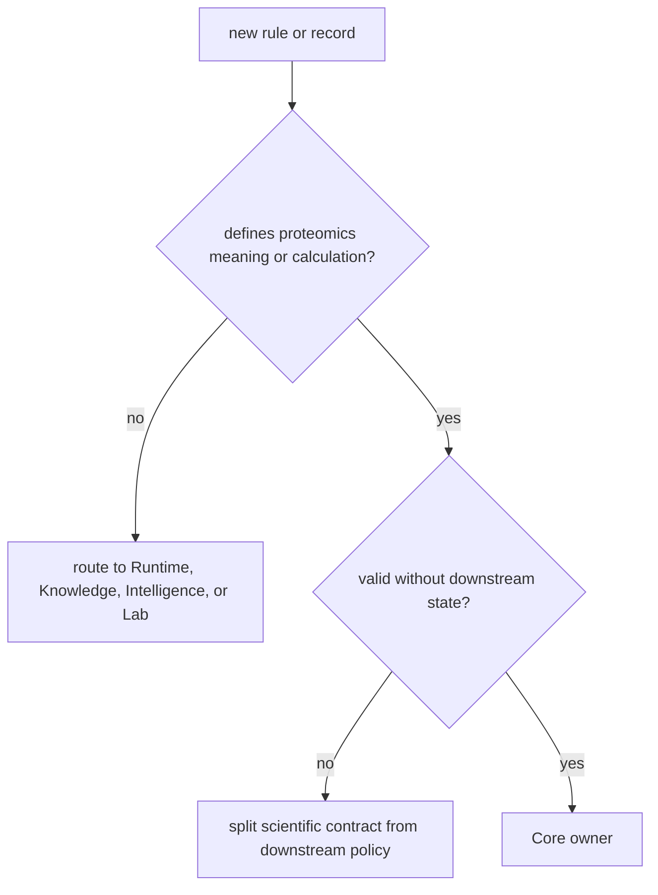

# Repository fit

Core is the scientific authority of the package family. It owns the meaning of
proteomics inputs, calculations, validation policies, result contracts, and
family-specific acceptance. It exists separately so scientific truth does not
depend on how work was scheduled, which evidence source was later consulted,
which action was preferred, or whether a laboratory could execute follow-up.

## The boundary in one question

Ask: **would this rule still mean the same thing if execution, literature,
ranking policy, and laboratory capacity all changed?**

- If yes, and the rule concerns a proteomics entity, calculation, or scientific
  acceptance contract, it belongs in Core.
- If the rule changes with provider state, evidence context, decision values, or
  operational readiness, it belongs with the corresponding owner.

## What Core contributes

| Responsibility | Durable output |
| --- | --- |
| input and format interpretation | typed accepted records, rejected records, diagnostics, and source lineage |
| sequence, chemistry, signal, identification, and inference | result contract with declared scientific assumptions |
| quantification and specialized workflows | matrices, uncertainty, QC, and domain-specific review records |
| workflow contracts | validated request, expected artifacts, refusal conditions, and acceptance policy |
| public evidence assets | family-specific corpus, challenge, comparison, and bounded acceptance record |

The package may render reports and assemble workflows, but those surfaces must
remain views and compositions of domain-owned contracts. A CLI handler, report
builder, or integrated demo is not a new scientific owner.

## Where the boundary is under pressure

Core is broad, and its source tree contains `interpretation`, `review`, `lab`,
and integrated workflow surfaces. Their names do not grant ownership over
neighboring package policy.

| Core surface | Allowed responsibility | Drift to reject |
| --- | --- | --- |
| `interpretation` | scientific reading of a governed result | source curation or final evidence sufficiency |
| `review` | scientific QC, explanations, and result inspection | recommendation policy or human authorization |
| `lab` | analytical QC and validation requirements | scheduling, custody, or assay execution authority |
| `workflow` | runtime-agnostic scientific composition | providers, checkpoints, retry, or persisted run state |
| `benchmarks` | scientific assets and acceptance burden | claiming execution or downstream consequence that was not observed |

## Fit tests

Core remains coherent when:

1. every algorithm is beside the domain contract whose meaning it implements;
2. rejected inputs, active policy, ambiguity, and known limits survive report
   assembly;
3. workflow requests remain executable by more than one Runtime implementation;
4. cross-package records keep their original owner and identity;
5. scientific acceptance never implies execution equivalence, grounded truth,
   recommendation authority, or laboratory value.

For the implemented domain map, read [scientific package map](package-overview.md).
For current family-level evidence, continue with the
[public benchmark catalog](flagship-public-benchmark-catalog.md) and
[known limitations](../quality/known-limitations.md).
