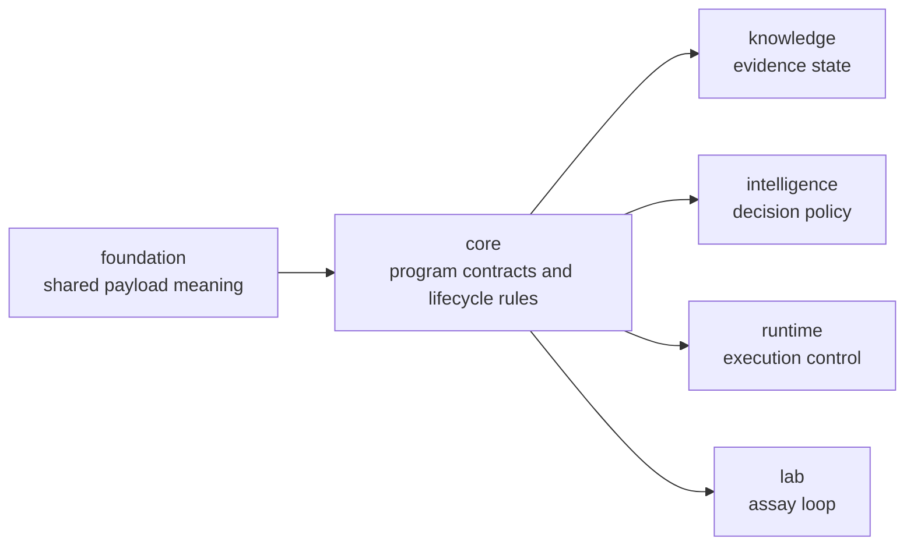

# bijux-proteomics-core

`bijux-proteomics-core` owns durable program contracts in
`bijux-proteomics`. It is where workflows, lifecycle state, gates, and other
long-lived rules are defined before downstream packages score, execute, or act
on them. If foundation is the shared language, core is the constitutional
layer: it decides which states exist, which transitions are legal, and which
constraints the rest of the system is not allowed to improvise around.

That role is broader and more concrete now than this page used to admit. Core
is not only a workflow-rule package. It is the repository's deepest scientific
owner: sequences, chemistry, spectra and mzML intake, identification,
quantification, PTM-facing review surfaces, benchmark asset packaging, and
workflow contracts all converge here before downstream packages interpret or
operationalize them.

## Why This Package Exists

- the system needs one place where workflow and gate semantics stay durable
- downstream packages should inherit program rules, not reinvent them
- lifecycle design should be inspectable before it turns into runtime behavior
  or policy code

## What It Owns

- program models and lifecycle rules
- gate semantics and durable workflow constraints
- core contracts that downstream packages depend on
- benchmark package shapes, scientific acceptance seams, and workflow-family
  contract language that must stay stable before downstream judgment begins

## What Makes This Package Scientifically Heavy

- benchmark-backed public workflow evidence starts here
- runtime, knowledge, intelligence, and lab all inherit scientific structure
  from this package before they add their own owner logic
- family-level trust pages depend on core package breadth more than any other
  owner surface in the repository
- chemistry, sequence, mzML, identification, quantification, and PTM-facing
  structures meet here before they become evidence state, recommendation
  policy, or lab consequence

## Shared Reader Routes

- Use [Benchmark Assets](https://bijux.io/bijux-proteomics/04-bijux-proteomics-core/foundation/benchmark-assets/)
  when the question is about public benchmark packages, lineage, or flagship
  acceptance before it becomes a package-local question.
- Use [Workflow Families](https://bijux.io/bijux-proteomics/01-bijux-proteomics/foundation/workflow-families/)
  when the question is which family currently deserves attention.

## Start Inside This Package

- Open [Foundation](https://bijux.io/bijux-proteomics/04-bijux-proteomics-core/foundation/)
  for the package role and contract boundary.
- Open [Architecture](https://bijux.io/bijux-proteomics/04-bijux-proteomics-core/architecture/)
  when the issue is internal program structure rather than public benchmark
  assets.
- Open [Interfaces](https://bijux.io/bijux-proteomics/04-bijux-proteomics-core/interfaces/)
  when the issue is a public contract or package-facing surface.

## Reader Questions This Package Can Answer

- which workflow states, lifecycle transitions, and benchmark-acceptance
  boundaries are treated as program law
- where a family-level scientific claim becomes a durable contract instead of a
  provisional interpretation
- which lower-level biological and chemistry inputs are normalized here before
  downstream packages are allowed to reason over them
- whether a benchmark package reflects a real review surface or only a shallow
  export of convenience

## Core Proof Surfaces

- foundation pages for the constitutional vocabulary and runtime-agnostic
  workflow contracts
- benchmark assets for public scientific packages, acceptance bars, and review
  lineage
- architecture pages for how scientific law, workflow models, and lifecycle
  transitions are kept separate from execution policy
- interfaces pages for package-facing contracts that downstream owners must not
  reinterpret

## What It Refuses

- shared serialization primitives that belong in foundation
- evidence truth and confidence policy that belong in knowledge
- execution orchestration that belongs in runtime

## Why Readers Should Not Skip Core

- if this package is under-described, the whole repository looks like runtime
  wrappers plus governance because the scientific contract layer stays hidden
- most public family trust language only makes sense once the reader sees the
  contract boundary that authorizes it
- deeper biology and chemistry breadth is easier to miss here because it is
  expressed as durable structures rather than narrative interpretation

## Strongest Proof Route

- start at [Benchmark Assets](https://bijux.io/bijux-proteomics/04-bijux-proteomics-core/foundation/benchmark-assets/)
  when the question is whether the repository has real public scientific
  evidence
- continue to [Foundation](https://bijux.io/bijux-proteomics/04-bijux-proteomics-core/foundation/)
  when the question is which scientific contracts and benchmark routes core
  actually owns
- hand off to runtime, knowledge, intelligence, or lab only after the core
  scientific contract is clear

## First Proof Check

- `packages/bijux-proteomics-core/src/bijux_proteomics`
- `packages/bijux-proteomics-core/tests`
- public contract artifacts when a core API surface changes
- flagship benchmark package manifests and acceptance-facing evidence routes
  when the question is whether core owns a real scientific proof surface
