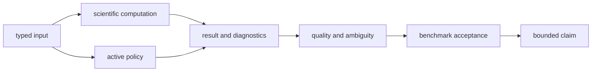
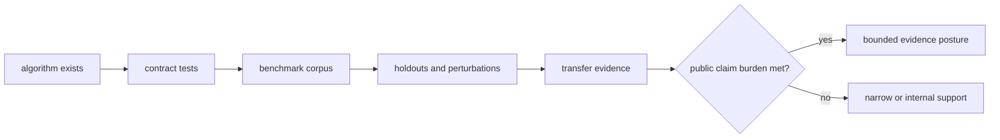
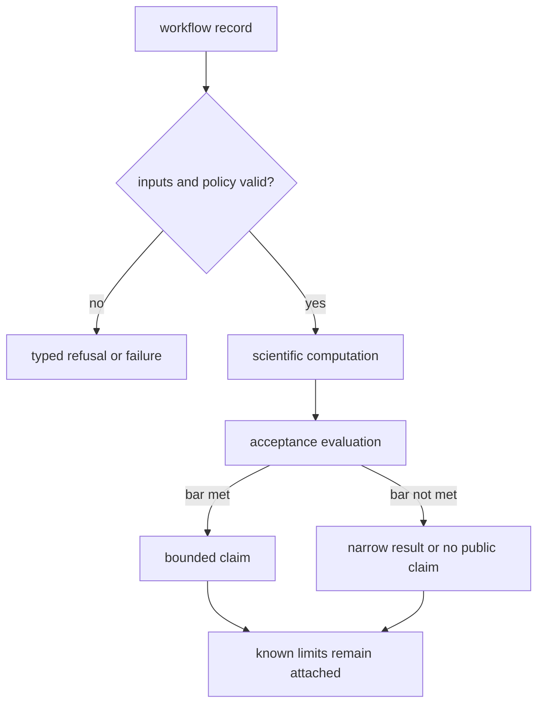
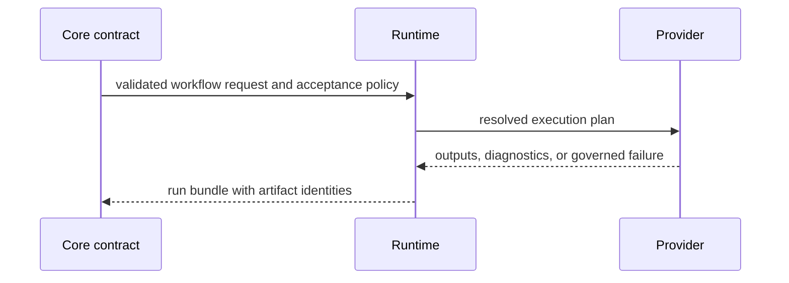
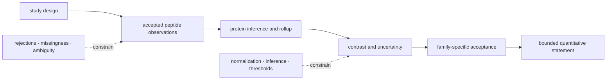

# bijux-proteomics-core

`bijux-proteomics-core` is the scientific engine of Bijux Proteomics. It turns
sequence, mass-spectrometry, experimental-design, and search-result inputs into
typed, reviewable scientific artifacts. It also owns the benchmark contracts
used to decide whether a workflow family is ready for public claims.

```bash
python -m pip install bijux-proteomics-core
bijux-proteomics --help
```

## Scientific pipeline

```mermaid
flowchart LR
    sequence["FASTA\nsequence and contaminants"]
    chemistry["digestion and chemistry\npeptides · modifications · fragments"]
    signal["spectra and chromatography\nMGF · mzML · XIC"]
    identify["identification\nsearch adapters · PSMs · FDR"]
    infer["protein inference\ngroups · parsimony · ambiguity"]
    quantify["quantification\nLFQ · DIA · multiplex"]
    review["review\nPTM · targeted · QC · biology"]
    benchmark["benchmark contracts\ncorpora · acceptance · evidence cards"]
    sequence --> chemistry --> signal --> identify --> infer --> quantify --> review --> benchmark
```



Each stage exposes its assumptions and result contracts. The package does not
require every analysis to traverse the entire diagram: FASTA operations,
spectrum review, search-result normalization, quantification, and targeted
assay review can be used as independent workflows.

Two paths accompany every supported workflow. The computation path produces a
scientific result; the evidence path records whether that result is credible
under the declared inputs, policies, perturbations, and comparison burden.



## A result is more than a value

Core artifacts retain the context needed to challenge a scientific result:

| Review question | Required context |
| --- | --- |
| What was accepted? | parsed records, schema identity, validation policy, and source digest |
| What was rejected? | rejected records, reason codes, thresholds, and strictness mode |
| Which scientific assumptions were active? | digestion, modification, mass-tolerance, FDR, inference, normalization, and workflow policy |
| How stable is the conclusion? | QC metrics, ambiguity, missingness, sensitivity, benchmark acceptance, and known limits |
| Can another system execute it? | typed workflow request, deterministic inputs, expected artifacts, and refusal conditions |

Dropping rejected inputs or active policy makes a concise report easier to
read but weaker to audit. Core keeps these details in machine-readable
artifacts so summaries never become the only surviving record.

## Capability map

| Domain | Implemented surfaces |
| --- | --- |
| sequence and study design | FASTA parsing, filtering, decoys, contaminants, checksums, digestion, sample sheets, feasibility and power estimates |
| chemistry | amino-acid and peptide mass, modifications, isotope envelopes, labels, fragment ions, adducts, open-search unknowns |
| signal and formats | MGF and mzML, spectra, XIC extraction and alignment, chromatography, normalized run bundles, format conversion |
| identification | Comet, DIA-NN, FragPipe, MaxQuant, OpenMS, Sage, and Spectronaut imports; PSM review; target-decoy FDR; calibration; contaminants |
| inference and quantification | peptide evidence, protein grouping and parsimony, LFQ, peptide/protein matrices, missingness, normalization, reproducibility |
| specialized workflows | DIA, PTM, proteoforms, isotope labeling, multiplex, targeted panels and transitions |
| interpretation and review | pathways, contrasts, biological reports, evidence cards, result queries, explanations, QC and failure explanations |
| benchmarks and workflow | public corpora, challenge assets, acceptance bars, workflow planning, validation, trust bundles |

## Interfaces

The curated package root exports a narrow intake path:
`DigestPolicy`, `parse_fasta_document`,
`parse_experimental_design_table`, `build_normalized_run_bundle`, and
`build_fdr_audit_trail`. Domain modules expose the wider Python API.

The `bijux-proteomics` CLI provides focused commands rather than one monolithic
pipeline. Representative routes include:

```bash
bijux-proteomics fasta-stats --help
bijux-proteomics digest --help
bijux-proteomics mzml-inspect --help
bijux-proteomics fdr --help
bijux-proteomics protein-lfq --help
bijux-proteomics diann-run-qc --help
bijux-proteomics ptm --help
bijux-proteomics targeted-panel-builder --help
bijux-proteomics public-benchmark-runner --help
```

Command output is designed for composition: machine-readable artifacts carry
the scientific result and provenance, while concise terminal output supports
operators. HTTP execution belongs to `bijux-proteomics-runtime`.

## Evidence posture

Core ships benchmark assets and acceptance logic, but capability breadth is not
equivalent to uniform validation. DDA, DIA, PTM, and targeted families have
outsider-auditable classifications. DDA, DIA, LFQ, PTM, and targeted also have
full outsider-readable packets, but packet completeness does not promote LFQ
beyond review-grade bounded. Multiplex remains internal support only. The
[public benchmark catalog](foundation/flagship-public-benchmark-catalog.md)
links each family to its lineage, comparisons, and limitations.



Benchmark evidence is evaluated per workflow family. Success in one family
does not transfer automatically to another instrument, acquisition method,
quantification regime, modification context, or laboratory consequence.

## Anatomy of scientific acceptance

Every accepted result should be reducible to a review record that separates
scientific output from the burden used to accept it.

| Record field | What it preserves | Review question |
| --- | --- | --- |
| workflow family and contract | the exact scientific problem and required outputs | is the acceptance bar relevant to this analysis? |
| input identity | source digests, sample design, references, contaminants, and exclusions | can the analyzed cohort be reconstructed? |
| active policy | tolerances, digestion, modifications, FDR, inference, normalization, and missingness rules | which assumptions could change the conclusion? |
| result and rejection sets | accepted values, rejected records, reason codes, and diagnostics | was inconvenient evidence discarded or retained? |
| acceptance evaluation | metric values, thresholds, holdouts, perturbations, and comparison results | did the record meet its declared burden? |
| evidence posture | internal, review-grade bounded, or outsider-auditable | what may be claimed publicly? |
| known limits | transfer boundaries, unresolved ambiguity, and unsupported contexts | where must the claim stop? |



An acceptance result is not a universal quality label. It applies to the named
family, corpus, policy, and evidence version recorded with the result.

## Handoff to Runtime

Core defines scientific meaning and the runtime-agnostic request. Runtime owns
provider selection, execution state, checkpoints, artifacts, and replay.



A completed run proves that the resolved plan reached a terminal operational
state. Core’s scientific acceptance logic determines whether the outputs meet
the workflow contract.

| Core sends | Runtime adds | Core evaluates on return |
| --- | --- | --- |
| validated request | resolved configuration and provider | artifact schema and scientific completeness |
| input identities and digests | execution state and checkpoints | input/output lineage |
| acceptance policy | logs, diagnostics, and refusal | thresholds, QC, ambiguity, and known limits |
| expected artifact contract | artifact ledger and hashes | family-specific acceptance result |

## Shared Reader Routes

### Trace a quantitative statement

“Protein abundance changed” is the end of a scientific argument, not a raw
output. Review the statement backward until every selection, aggregation, and
acceptance decision resolves to a typed record.

| Statement dependency | Record to inspect | A reason to narrow or refuse |
| --- | --- | --- |
| cohort and contrast | experimental design, sample mapping, covariates, exclusions | groups are ambiguous, underpowered, confounded, or changed after analysis |
| peptide evidence | normalized observations, identification confidence, contaminants, missingness | evidence is unsupported, inconsistently mapped, or dominated by loss |
| protein rollup | peptide-to-protein mapping, shared-peptide policy, ambiguity | grouping or parsimony cannot support the named protein-level subject |
| quantitative model | normalization, imputation, weighting, contrast statistic, uncertainty | conclusion depends on an undisclosed or unstable policy choice |
| acceptance | QC, thresholds, perturbations, holdout behavior, benchmark lineage | family-specific burden is unmet or does not transfer to this context |
| public wording | evidence posture and known limits | sentence exceeds the weakest supported dependency |



The [Workflow Families](../01-bijux-proteomics/foundation/workflow-families.md)
ledger defines the public ceiling, the
[benchmark catalog](foundation/flagship-public-benchmark-catalog.md) supplies
family evidence, [Runtime](../09-bijux-proteomics-runtime/index.md) records the
execution, and [Decision Support](../01-bijux-proteomics/foundation/decision-support.md)
begins only after the scientific statement is accepted.

## Start Inside

| Need | Read next |
| --- | --- |
| map scientific domains to their owners | [package overview](foundation/package-overview.md) |
| audit benchmark provenance and redistribution | [benchmark assets](foundation/benchmark-assets.md) and the [asset audit](foundation/benchmark-asset-audit.md) |
| inspect family-specific lineage | [DDA](foundation/dda-benchmark-lineage.md), [DIA](foundation/dia-benchmark-lineage.md), [LFQ](foundation/lfq-benchmark-lineage.md), [PTM](foundation/ptm-benchmark-lineage.md), [targeted](foundation/targeted-benchmark-lineage.md), or [multiplex](foundation/multiplex-benchmark-lineage.md) |
| choose Python, CLI, data, or artifact interfaces | [interfaces](interfaces/index.md) |
| execute a supported scientific route | [common workflows](operations/common-workflows.md) |
| review scientific and implementation limits | [known limitations](quality/known-limitations.md) |

Core does not own run orchestration, evidence reconciliation, recommendation
policy, or lab scheduling. Those responsibilities belong to runtime,
knowledge, intelligence, and lab respectively.
