# bijux-proteomics-core

`bijux-proteomics-core` is the scientific engine of Bijux Proteomics. It turns
sequence, mass-spectrometry, experimental-design, and search-result inputs into
typed, reviewable scientific artifacts. It also owns the benchmark contracts
used to decide whether a workflow family is ready for public claims.

```bash
python -m pip install bijux-proteomics-core
bijux-proteomics --help
```

## Scientific pipeline

```mermaid
flowchart LR
    sequence["FASTA\nsequence and contaminants"]
    chemistry["digestion and chemistry\npeptides · modifications · fragments"]
    signal["spectra and chromatography\nMGF · mzML · XIC"]
    identify["identification\nsearch adapters · PSMs · FDR"]
    infer["protein inference\ngroups · parsimony · ambiguity"]
    quantify["quantification\nLFQ · DIA · multiplex"]
    review["review\nPTM · targeted · QC · biology"]
    benchmark["benchmark contracts\ncorpora · acceptance · evidence cards"]
    sequence --> chemistry --> signal --> identify --> infer --> quantify --> review --> benchmark
```



Each stage exposes its assumptions and result contracts. The package does not
require every analysis to traverse the entire diagram: FASTA operations,
spectrum review, search-result normalization, quantification, and targeted
assay review can be used as independent workflows.

## Capability map

| Domain | Implemented surfaces |
| --- | --- |
| sequence and study design | FASTA parsing, filtering, decoys, contaminants, checksums, digestion, sample sheets, feasibility and power estimates |
| chemistry | amino-acid and peptide mass, modifications, isotope envelopes, labels, fragment ions, adducts, open-search unknowns |
| signal and formats | MGF and mzML, spectra, XIC extraction and alignment, chromatography, normalized run bundles, format conversion |
| identification | Comet, DIA-NN, FragPipe, MaxQuant, OpenMS, Sage, and Spectronaut imports; PSM review; target-decoy FDR; calibration; contaminants |
| inference and quantification | peptide evidence, protein grouping and parsimony, LFQ, peptide/protein matrices, missingness, normalization, reproducibility |
| specialized workflows | DIA, PTM, proteoforms, isotope labeling, multiplex, targeted panels and transitions |
| interpretation and review | pathways, contrasts, biological reports, evidence cards, result queries, explanations, QC and failure explanations |
| benchmarks and workflow | public corpora, challenge assets, acceptance bars, workflow planning, validation, trust bundles |

## Interfaces

The curated package root exports a narrow intake path:
`DigestPolicy`, `parse_fasta_document`,
`parse_experimental_design_table`, `build_normalized_run_bundle`, and
`build_fdr_audit_trail`. Domain modules expose the wider Python API.

The `bijux-proteomics` CLI provides focused commands rather than one monolithic
pipeline. Representative routes include:

```bash
bijux-proteomics fasta-stats --help
bijux-proteomics digest --help
bijux-proteomics mzml-inspect --help
bijux-proteomics fdr --help
bijux-proteomics protein-lfq --help
bijux-proteomics diann-run-qc --help
bijux-proteomics ptm --help
bijux-proteomics targeted-panel-builder --help
bijux-proteomics public-benchmark-runner --help
```

Command output is designed for composition: machine-readable artifacts carry
the scientific result and provenance, while concise terminal output supports
operators. HTTP execution belongs to `bijux-proteomics-runtime`.

## Evidence posture

Core ships benchmark assets and acceptance logic, but capability breadth is not
equivalent to uniform validation. DDA, DIA, PTM, and targeted families have
outsider-auditable routes. LFQ is review-grade with explicit limits. Multiplex
remains an internal support surface. Start with the
[public benchmark catalog](foundation/flagship-public-benchmark-catalog.md)
and follow the family-specific lineage before making a scientific claim.

## Documentation map

- [Package overview](foundation/package-overview.md) maps the source domains
  and their scientific responsibility.
- [Benchmark assets](foundation/benchmark-assets.md) covers provenance,
  redistribution, freshness, and incompleteness.
- [Architecture](architecture/index.md) explains internal boundaries and
  extension seams.
- [Interfaces](interfaces/index.md) covers Python, CLI, data, configuration,
  and artifacts.
- [Common workflows](operations/common-workflows.md) provides executable user
  routes.
- [Known limitations](quality/known-limitations.md) records scientific and
  implementation limits.

Core does not own run orchestration, evidence reconciliation, recommendation
policy, or lab scheduling. Those responsibilities belong to runtime,
knowledge, intelligence, and lab respectively.
