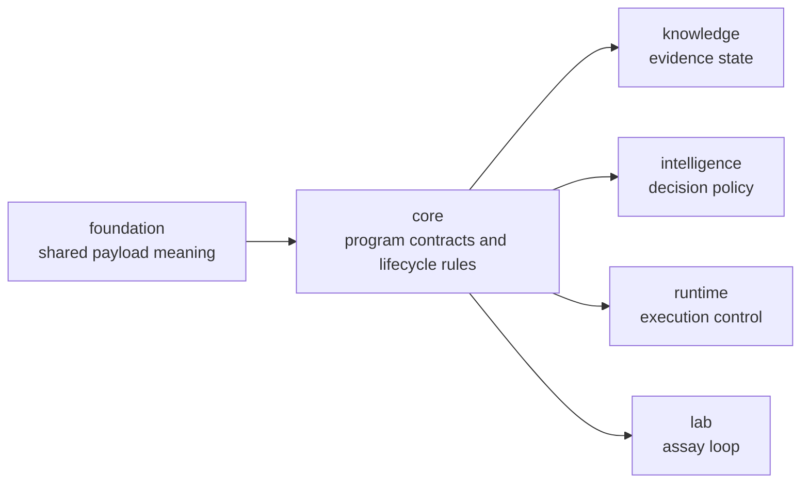

# bijux-proteomics-core

`bijux-proteomics-core` owns durable program contracts in
`bijux-proteomics`. It is where workflows, lifecycle state, gates, and other
long-lived rules are defined before downstream packages score, execute, or act
on them. If foundation is the shared language, core is the constitutional
layer: it decides which states exist, which transitions are legal, and which
constraints the rest of the system is not allowed to improvise around.

## Why This Package Exists

- the system needs one place where workflow and gate semantics stay durable
- downstream packages should inherit program rules, not reinvent them
- lifecycle design should be inspectable before it turns into runtime behavior
  or policy code

## What It Owns

- program models and lifecycle rules
- gate semantics and durable workflow constraints
- core contracts that downstream packages depend on

## Shared Reader Routes

- Use [Benchmark Assets](https://bijux.io/bijux-proteomics/04-bijux-proteomics-core/foundation/benchmark-assets/)
  when the question is about public benchmark packages, lineage, or flagship
  acceptance before it becomes a package-local question.
- Use [Workflow Families](https://bijux.io/bijux-proteomics/01-bijux-proteomics/foundation/workflow-families/)
  when the question is which family currently deserves attention.

## Start Inside This Package

- Open [Foundation](https://bijux.io/bijux-proteomics/04-bijux-proteomics-core/foundation/)
  for the package role and contract boundary.
- Open [Architecture](https://bijux.io/bijux-proteomics/04-bijux-proteomics-core/architecture/)
  when the issue is internal program structure rather than public benchmark
  assets.
- Open [Interfaces](https://bijux.io/bijux-proteomics/04-bijux-proteomics-core/interfaces/)
  when the issue is a public contract or package-facing surface.

## What It Refuses

- shared serialization primitives that belong in foundation
- evidence truth and confidence policy that belong in knowledge
- execution orchestration that belongs in runtime

## First Proof Check

- `packages/bijux-proteomics-core/src/bijux_proteomics`
- `packages/bijux-proteomics-core/tests`
- public contract artifacts when a core API surface changes
