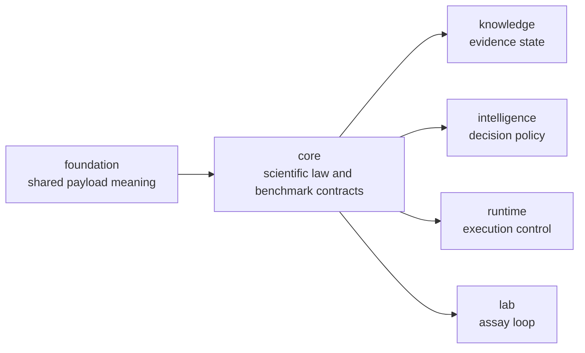

# bijux-proteomics-core

`bijux-proteomics-core` owns durable scientific contracts in
`bijux-proteomics`. If foundation is the shared language, core is the package
where that language becomes scientific law: workflow families, benchmark
acceptance, lifecycle transitions, and runtime-agnostic workflow contracts are
defined here before downstream packages are allowed to interpret, execute, or
operationalize them.

That role is broader and more concrete now than older docs admitted. Core is
not only a workflow-rule package. It is the repository's deepest scientific
owner: sequences, chemistry, spectra and mzML intake, identification,
quantification, PTM-facing review surfaces, benchmark asset packaging, and
workflow contracts all converge here before downstream packages score or act.

## Why This Package Exists

- the system needs one place where scientific law stays durable before runtime
  behavior or recommendation policy begins
- downstream packages should inherit benchmark-acceptance and lifecycle rules,
  not reinvent them
- public workflow-family trust language needs one contract owner that can be
  inspected independently of judgment or execution

## What It Owns

- scientific law and benchmark-acceptance boundaries
- runtime-agnostic workflow contracts and lifecycle transitions
- benchmark package shapes, challenge-corpus seams, and flagship scientific
  contract language
- typed sequence, chemistry, spectra, mzML, identification, quantification,
  PTM, DIA, and review surfaces that downstream packages consume rather than
  recreate

## Concrete Scientific Families

| owner band | visible package substance | why it matters to readers |
| --- | --- | --- |
| sequence and study | `domain`, `sequences`, `study` | sample, sequence, and design semantics are normalized before downstream interpretation |
| chemistry | `chemistry`, `isotope_labeling`, `proteoforms` | mass, fragments, isotopes, and modifications are first-class scientific owners |
| proteomics I/O | `io`, `identification`, `interfaces` | spectra, mzML, search normalization, and reviewable ingestion stop being hidden support glue |
| quantitative and review surfaces | `quantification`, `review`, `ptm`, `targeted`, `dia`, `lab/qc` | analytical and assay-facing outputs start from durable scientific contracts |
| benchmark and workflow law | `benchmarks`, `workflow`, `interpretation` | public workflow-family claims now have explicit evidence and contract roots |

## Why This Package Feels Heavier Now

- benchmark-backed public workflow evidence starts here instead of being
  scattered across reports
- runtime, knowledge, intelligence, and lab all inherit scientific structure
  from this package before adding owner-local meaning
- family-level trust pages depend on core package breadth more than any other
  owner surface in the repository
- deeper biology and chemistry breadth is now visible as real package-owned
  structures rather than inferred from later prose

## Shared Reader Routes

- Use [Benchmark Assets](https://bijux.io/bijux-proteomics/04-bijux-proteomics-core/foundation/benchmark-assets/)
  when the question is about public benchmark packages, lineage, or flagship
  acceptance before it becomes a package-local question.
- Use [Workflow Families](https://bijux.io/bijux-proteomics/01-bijux-proteomics/foundation/workflow-families/)
  when the question is which family currently deserves attention.
- Use [Decision Support](https://bijux.io/bijux-proteomics/01-bijux-proteomics/foundation/decision-support/)
  when the question is whether a strong benchmark packet still loses later to
  grounding, judgment, or consequence.

## Start Inside This Package

- Open [Foundation](https://bijux.io/bijux-proteomics/04-bijux-proteomics-core/foundation/)
  for the package role, ownership boundary, and benchmark-facing proof chain.
- Open [Package Overview](https://bijux.io/bijux-proteomics/04-bijux-proteomics-core/foundation/package-overview/)
  when the question is which scientific families actually live here and why the
  package is heavier than it first appears.
- Open [Flagship Public Benchmark Catalog](https://bijux.io/bijux-proteomics/04-bijux-proteomics-core/foundation/flagship-public-benchmark-catalog/)
  when the question is which paired public benchmark packets the repository
  really ships.
- Open [Architecture](https://bijux.io/bijux-proteomics/04-bijux-proteomics-core/architecture/)
  when the issue is internal structure rather than public benchmark evidence.
- Open [Interfaces](https://bijux.io/bijux-proteomics/04-bijux-proteomics-core/interfaces/)
  when the issue is a public contract or package-facing surface.

## Reader Questions This Package Can Answer

- which workflow states, lifecycle transitions, and benchmark-acceptance
  boundaries are treated as program law
- where a workflow-family scientific claim becomes a durable contract instead
  of a provisional interpretation
- which lower-level biological and chemistry inputs are normalized here before
  downstream packages are allowed to reason over them
- whether a benchmark package reflects a real review surface or only a shallow
  export of convenience

## What A Skeptical Reader Should Verify

- whether a claimed scientific family is backed by typed owner surfaces rather
  than by report prose alone
- whether chemistry, spectra, search, quantification, PTM, and targeted
  analysis are truly package-owned instead of being spread through demos and
  runtime wrappers
- whether benchmark packages point back to real scientific law inside core
  instead of acting as decorative fixtures

## What It Refuses

- shared serialization primitives that belong in foundation
- evidence truth and contradiction policy that belong in knowledge
- recommendation posture that belongs in intelligence
- execution orchestration that belongs in runtime
- assay-worth and outcome meaning that belong in lab

## Strongest First Proof

- start at [Flagship Public Benchmark Catalog](https://bijux.io/bijux-proteomics/04-bijux-proteomics-core/foundation/flagship-public-benchmark-catalog/)
  when the question is whether the repository has real public scientific
  packets
- continue to [Benchmark Assets](https://bijux.io/bijux-proteomics/04-bijux-proteomics-core/foundation/benchmark-assets/)
  when the question becomes freshness, licensing, lineage, and acceptance
- hand off to runtime, knowledge, intelligence, or lab only after the core
  scientific contract is clear

## First Proof Check

- `packages/bijux-proteomics-core/src/bijux_proteomics`
- `packages/bijux-proteomics-core/tests`
- flagship benchmark package manifests and acceptance-facing evidence routes
- architecture and interface pages once the question narrows to one local
  scientific contract
