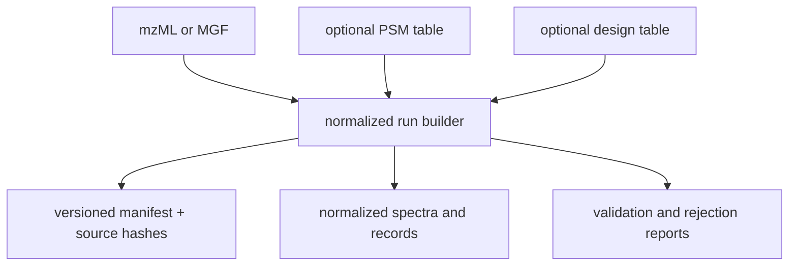

# Scientific artifact contracts

A core artifact must let another reader determine what entered a calculation,
what policy governed it, what was rejected, and what the package concluded.
Exporting only a polished result table loses that evidence chain.

## Normalized run bundle

`build_normalized_run_bundle()` materializes a portable directory from mzML or
MGF spectra and optional identification and design inputs. Its manifest records:

- a versioned `DocumentSchema` envelope;
- harmonized sample and run metadata;
- every source path, detected format, and SHA-256 digest;
- every generated relative file;
- accepted spectrum and PSM counts;
- rejected spectrum and identification-row counts.

The bundle includes normalized MGF spectra and a spectra validation report.
When supplied, identification and design inputs add their normalized exports
and validation evidence. The returned manifest is the inventory for the
directory; consumers should not infer completeness by globbing files.

The bundle proves normalization under the recorded implementation and
policies. It does not certify spectrum quality, PSM correctness, or study
fitness.

## Analysis artifacts

Core analysis surfaces emit typed JSON-compatible records before presentation:

- FDR audit trails retain ranking, tie groups, target-decoy accumulation,
  q-values, acceptance, policy, and reproducibility hash;
- protein-inference outputs retain groups, ambiguity, peptide support, and
  parsimony decisions;
- quantification and differential-analysis outputs retain normalization,
  missingness, contrast, correction, and uncertainty context;
- PTM outputs retain localization ambiguity, site mapping, occupancy or
  stoichiometry assumptions, and site-level FDR boundaries;
- interpretation outputs retain enrichment inputs, background universes,
  correction policy, and limitations.

Do not reduce these records to identifiers and scores at a package boundary.
The diagnostics and policy fields are part of the scientific result.

## Evidence and review artifacts

Review-facing exports may include JSON, JSONL, TSV, Markdown, HTML, or bundle
manifests. Their roles differ:

| Artifact | Canonical use |
| --- | --- |
| typed JSON/JSONL | machine exchange and validated reconstruction |
| TSV | sortable, flat reviewer view |
| Markdown/HTML | narrative interpretation with limitations |
| manifest | inventory, source identity, and lineage |
| validation report | accepted/rejected accounting and diagnostics |

Keep source files immutable, write derived artifacts to a new governed
location, and retain the manifest plus validation reports beside the result.
If a renderer cannot represent nested ambiguity or provenance, link it to the
canonical typed record instead of silently flattening meaning.

## Consumer checks

Before accepting a core artifact, verify its schema version, source digests,
declared policy, accepted and rejected counts, generated-file inventory, and
scientific limitations. A missing rejection report or policy is a loss of
evidence, even when the headline output appears plausible.
