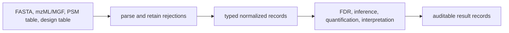
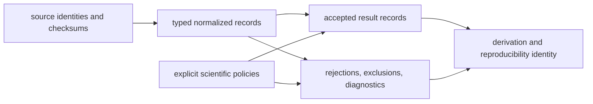

# Scientific data contracts

Core owns the scientific records that turn vendor-neutral inputs into reviewable
proteomics results. Validation is deliberately layered: syntax, normalization,
scientific policy, and interpretation are distinct claims.

## Sequence and search-space records

`parse_fasta_document()` returns a `FastaParseReport`, not an unqualified list
of proteins. Accepted records preserve normalized accessions, descriptions,
residues, annotations, and sequence checksums. Rejected records retain the
source identifier and structured issues. Duplicate identifiers and normalized
accessions are reported under explicit policies.

Strict acceptance establishes formatting and residue validity only. It does not
establish biological identity, database completeness, taxonomic correctness, or
suitability of the resulting search space. Digestion uses a `DigestPolicy` so
enzyme, specificity, missed cleavages, peptide length, and residue handling can
travel with derived peptides.

## Acquisition and identification records

The format layer normalizes:

- mzML or MGF spectra, including rejected spectra and acquisition metadata;
- peptide-spectrum matches with spectrum, peptide, charge, score, rank,
  protein references, and target-decoy classification;
- modification registries and localized PTM evidence;
- experimental-design rows with sample, condition, replicate, fraction, batch,
  pairing, run order, instrument, search engine, and multiplex metadata.

Parsers return accepted and rejected evidence separately. A structurally valid
PSM is not automatically accepted at an FDR threshold, and a structurally valid
design does not prove balance or correspondence with acquisition reality.

## Experimental design

`ExperimentalDesignEntry` rejects unknown fields and enforces positive
replicate and fraction numbers. Multiplex group and channel must appear
together; pooled-reference and QC-bridge rows require both. Additional columns
remain available in the row's metadata mapping.

`parse_experimental_design_table()` accumulates invalid rows in an
`ExperimentalDesignReport`. Filesystem failures still raise, while row-level
conversion problems remain inspectable rather than terminating the entire
table.

## Statistical evidence

FDR records preserve the policy and derivation, not only a final thresholded
list. `FdrAuditTrail` contains:

| Field | Meaning |
| --- | --- |
| `policy` | score orientation, tie handling, and optional threshold |
| `entries` | ranked target-decoy state, cumulative counts, FDR, q-value, acceptance |
| `reproducibility_hash` | identity of the governed calculation inputs and policy |

Protein inference, quantification, PTM localization, differential analysis, and
biological interpretation follow the same pattern: typed inputs, an explicit
policy, structured results, diagnostics, and caveats. Downstream consumers
should preserve the result model and policy together.

## A Reviewable Scientific Packet

The smallest trustworthy exchange is not a result table by itself. It is the
connected packet that lets another reader reconstruct why each row exists:

| Packet member | Minimum review question |
| --- | --- |
| source identity | Can the exact inputs and their origin be resolved? |
| normalized record | Which information was preserved, normalized, or lost? |
| policy | Which thresholds, ordering rules, and scientific assumptions governed the calculation? |
| accepted result | Which typed evidence survived the declared gates? |
| rejected evidence | Which rows or claims failed, and for what structured reason? |
| lineage identity | Can the derivation be compared across implementations or reruns? |

If accepted results are portable but rejections or policy are not, the packet
cannot support an independent audit of selection effects.

## Contract invariants

- Unknown fields are rejected on governed exchange models.
- Accepted and rejected inputs remain countable and attributable.
- Source identifiers are preserved when normalization creates canonical forms.
- Ordering and tie policies are explicit wherever they affect results.
- A deterministic hash supports reproducibility checks; it is not proof of
  scientific validity or provenance.
- Rendered tables and reports are views of typed records, not alternate sources
  of truth.

These invariants establish inspectability, not universal validity. Family
acceptance still depends on the benchmark and pressure evidence appropriate to
DDA, DIA, LFQ, multiplex, PTM, or targeted analysis.

See [artifact contracts](artifact-contracts.md) for the files that carry these
records across workflow boundaries.
