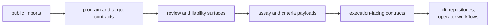

# Interfaces

`bijux-proteomics-core` interfaces are where the domain speaks in public. This
section should make it obvious which surfaces define protein programs, lifecycle
gates, assay requirements, and execution readiness so a reader can tell where
governance ends and orchestration begins.

## What Makes These Interfaces Important

- they publish the constitutional rules of the proteomics program model
- they are meant to be consumed by both code and review processes, not just by
  Python call sites
- they define readiness and progression without owning runtime execution itself

## Start With

- open [Data Contracts](https://bijux.io/bijux-proteomics/04-bijux-proteomics-core/interfaces/data-contracts/)
  when the question is what a program, review, assay, or gate payload is
  allowed to mean
- open [Operator Workflows](https://bijux.io/bijux-proteomics/04-bijux-proteomics-core/interfaces/operator-workflows/)
  when the reader is less interested in Python and more interested in how the
  package is actually used in governed work
- open [Public Imports](https://bijux.io/bijux-proteomics/04-bijux-proteomics-core/interfaces/public-imports/)
  and [CLI Surface](https://bijux.io/bijux-proteomics/04-bijux-proteomics-core/interfaces/cli-surface/)
  when the question starts from code or command entrypoints
- open [Compatibility Commitments](https://bijux.io/bijux-proteomics/04-bijux-proteomics-core/interfaces/compatibility-commitments/)
  before widening or narrowing any public domain promise

## Read By Domain Question

- [Public Imports](https://bijux.io/bijux-proteomics/04-bijux-proteomics-core/interfaces/public-imports/)
  for the exported domain vocabulary
- [Data Contracts](https://bijux.io/bijux-proteomics/04-bijux-proteomics-core/interfaces/data-contracts/)
  and [Artifact Contracts](https://bijux.io/bijux-proteomics/04-bijux-proteomics-core/interfaces/artifact-contracts/)
  for the durable forms of those rules
- [API Surface](https://bijux.io/bijux-proteomics/04-bijux-proteomics-core/interfaces/api-surface/),
  [CLI Surface](https://bijux.io/bijux-proteomics/04-bijux-proteomics-core/interfaces/cli-surface/),
  and [Configuration Surface](https://bijux.io/bijux-proteomics/04-bijux-proteomics-core/interfaces/configuration-surface/)
  for how operators and tooling touch the domain
- [Entrypoints and Examples](https://bijux.io/bijux-proteomics/04-bijux-proteomics-core/interfaces/entrypoints-and-examples/)
  and [Compatibility Commitments](https://bijux.io/bijux-proteomics/04-bijux-proteomics-core/interfaces/compatibility-commitments/)
  for the cost of changing those surfaces

## What This Section Should Settle

- which public surfaces define program authority
- where a downstream package may depend on core contracts without taking over
  core governance
- how to distinguish execution readiness from actual execution ownership

## First Proof Check

- `src/bijux_proteomics/program_spec.py`, `programs.py`, and `targets.py`
- `src/bijux_proteomics/cli.py` and `interfaces/cli.py`
- `packages/bijux-proteomics-core/tests`
