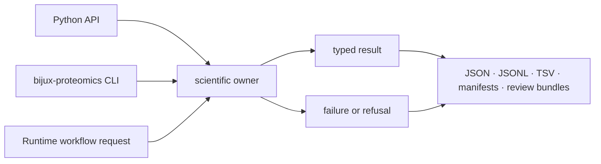

# Scientific interfaces

Core interfaces expose scientific operations through Python, CLI, and portable
artifacts. All three routes share the same domain contracts: format acceptance,
scientific policy, result schema, rejected-input evidence, QC, and typed failure
must not change merely because the caller changes.



## Choose an entry route

| Need | Interface | Appropriate when |
| --- | --- | --- |
| common intake from Python | curated package root | one of the five stable root operations is sufficient |
| specialized scientific work | owning family module | the caller needs domain-specific policies, reports, or reason codes |
| shell composition or inspection | `bijux-proteomics` CLI | files and machine-readable artifacts are the natural boundary |
| governed multi-operation execution | Runtime request consuming Core contracts | lifecycle, providers, checkpoints, or replay are required |
| cross-process review | artifact contract | another tool or reviewer must inspect the exact result independently |

The package root intentionally exposes only `DigestPolicy`,
`parse_fasta_document`, `parse_experimental_design_table`,
`build_normalized_run_bundle`, and `build_fdr_audit_trail`. Use
[public imports](public-imports.md) to find the supported owner module for wider
capabilities. Do not treat every importable internal symbol as public API.

## Result contract

A reviewable result preserves more than its headline values:

| Contract element | Examples |
| --- | --- |
| source identity | input digest, file identity, external engine and version |
| normalized policy | protease, modification set, tolerances, FDR method, inference or normalization rule |
| accepted material | parsed proteins, PSMs, peptides, groups, quantities, sites, transitions |
| excluded material | rejected rows, contaminants, decoys, ambiguous assignments, missing observations |
| diagnostics and QC | counts, distributions, calibration, missingness, interference, sensitivity |
| compatibility | schema identity, producer version, migration posture |
| scientific limits | unresolved ambiguity, transfer boundary, heuristic status, unavailable evidence |

See [data contracts](data-contracts.md) for field invariants and
[artifact contracts](artifact-contracts.md) for persisted representations.

## CLI behavior

CLI commands validate arguments before scientific work, write machine-readable
outputs atomically, and return nonzero status for invalid input or governed
failure. Concise terminal text is an operator aid; it is not the authoritative
scientific artifact.

```bash
bijux-proteomics fasta-parse --help
bijux-proteomics digest --help
bijux-proteomics fdr --help
bijux-proteomics protein-lfq --help
bijux-proteomics ptm --help
bijux-proteomics targeted-panel-builder --help
```

The [CLI surface](cli-surface.md) documents commands and exit behavior.
[Operator workflows](operator-workflows.md) connects commands into defensible
scientific sequences, while [entrypoints and examples](entrypoints-and-examples.md)
provides focused invocations.

## Artifact custody

JSON and table exports are deterministic where their contract promises stable
ordering. A manifest identifies inputs, parameters, producer, and owned output
files. Review bundles connect primary results to diagnostics and limitations
without replacing the primary artifacts.

An artifact proves what Core serialized under a declared policy. It does not by
itself prove that an external engine behaved correctly, that a run can be
replayed, that evidence is sufficient for a recommendation, or that an assay is
safe to execute.

## Configuration boundary

Scientific configuration belongs with the Core operation: digestion,
modification, tolerance, scoring, inference, normalization, or workflow-family
policy. Process configuration—provider choice, resources, retries, service
transport, checkpoints, and scheduling—belongs to Runtime. See
[configuration surface](configuration-surface.md) before adding a setting.

## Compatibility

Public imports, command names, fields, enumerations, artifact schemas, defaults,
and failure behavior are compatibility surfaces. A change may require a schema
migration even when Python imports remain unchanged. [Compatibility commitments](compatibility-commitments.md)
defines the review burden for those changes; [API surface](api-surface.md)
identifies the curated facade and its evidence.
