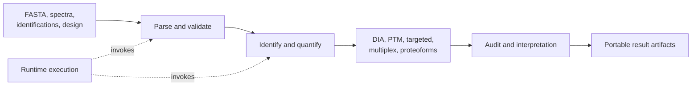

# Interfaces

Core exposes the scientific contracts and transformations that turn proteomics
inputs into inspectable analysis artifacts. Its interfaces cover sequence
intake, experimental design, identification, quantification, specialized assay
families, interpretation, review, and workflow planning. They do not grant
execution authority or make release decisions on behalf of consuming systems.

## Interface layers

| Layer | Consumer need | Core responsibility | Explicit limit |
| --- | --- | --- | --- |
| root Python facade | begin common intake and audit operations | five curated, dependency-light exports | not a mirror of the entire package |
| scientific modules | use a specific analytical capability | typed inputs, policies, reports, and reason codes | not orchestration or service hosting |
| CLI | run independently reviewable operations | argument validation, artifact writing, non-zero failure | not a workflow scheduler |
| artifact contracts | move results across processes or packages | schema, lineage, parameters, thresholds, accepted and rejected records | not proof of scientific fitness |
| workflow contracts | plan and validate multi-operation work | runtime-agnostic plans and requirements | not process ownership |

## Start from the question

- For the five stable package-root imports and their behavior, use
  [Python API and CLI surface](api-surface.md).
- For choosing package-root, family facade, or specialized module imports, use
  [Public imports](public-imports.md).
- For field meanings, invariants, and failure records, use
  [Data contracts](data-contracts.md).
- For persisted JSON, JSONL, TSV, manifests, and review bundles, use
  [Artifact contracts](artifact-contracts.md).
- For command names and exit behavior, use [CLI surface](cli-surface.md).
- For end-to-end operator sequences, use
  [Operator workflows](operator-workflows.md).

## Ownership boundary

Core owns scientific semantics: how FASTA records are accepted or rejected,
which digestion policy was applied, how design rows are normalized, how FDR is
calculated, and which thresholds produced an accepted result. Runtime owns
process execution, service transport, resource policy, and retry behavior.
Intelligence owns decision posture; knowledge owns evidence memory and
reconciliation; lab owns assay planning and experimental consequences.

This boundary matters when interpreting status. A successful core operation
means its declared contract completed. It does not mean a service deployment
succeeded, a candidate should advance, a knowledge conflict is resolved, or an
experiment is safe to run.

## Evidence carried by results

Reader-facing outputs should retain enough information to answer:

1. Which source records and parameters entered the operation?
2. Which records were accepted, rejected, or refused, and why?
3. Which policy, threshold, score orientation, or normalization rule applied?
4. Which schema and package version produced the artifact?
5. Which later interpretation is scientific judgment rather than computed
   output?

The implementation beneath `packages/bijux-proteomics-core/src/bijux_proteomics/`
is the behavior authority. Curated `public_api` ledgers and package tests guard
the supported facades; documentation explains how to use them without
overstating what the resulting artifacts prove.
