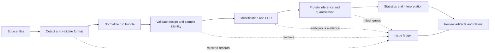

# Scientific analysis workflow

Core turns heterogeneous proteomics inputs into reviewable scientific
artifacts. The central operational rule is to preserve every acceptance,
rejection, mapping, and policy decision between raw input and biological
interpretation. A successful process exit is not evidence that every record
participated in the result.

## Establish the input contract

1. Detect the source format and run its validation surface before conversion.
2. Parse FASTA, spectra, identifications, and experimental design with the
   strictness appropriate to the study. Retain accepted and rejected records.
3. Build a normalized run bundle. Its manifest anchors source hashes,
   generated files, record counts, rejection counts, schema version, and run
   metadata.
4. Confirm sample identifiers, conditions, replicates, batches, pairing, and
   referenced files before computing a contrast.

Stop if a required file is missing, the design cannot identify the intended
comparison, target-decoy labeling is ambiguous, or normalization would proceed
without the required quantitative context.

## Produce evidence by level

1. Normalize PSMs and record score orientation and search-engine dialect.
2. Estimate error rates at the level being claimed. Peptide, protein, and PTM
   site results cannot inherit a PSM-level threshold by implication.
3. Preserve peptide-to-protein ambiguity through grouping or an explicit
   shared-peptide policy before protein rollup.
4. Apply quantitative normalization and missingness policy before differential
   testing. Record condition order, covariates, pairing, and multiple-testing
   correction.
5. Add annotations, pathways, complexes, regulators, or drug-target context
   only after the statistical evidence is stable.

## Review the result

Review the typed artifacts, not only charts or prose. The minimum handoff
contains the normalized-run manifest, validated workflow configuration,
acceptance and issue ledgers, FDR evidence, protein-inference result,
quantification and statistical reports, and the biological claim bundle.

A rerun is comparable only when source hashes and policy-bearing configuration
match. A changed threshold, normalization method, database, design mapping, or
annotation release is a new evidence context and should be labeled as such.

Start with [Entrypoints and worked examples](entrypoints-and-examples.md), then
use [Scientific data contracts](data-contracts.md) to inspect each artifact
boundary.
