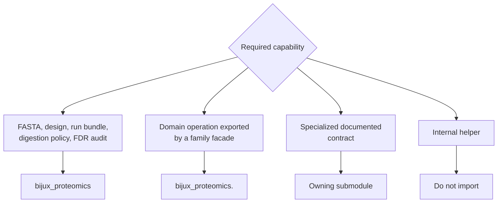

# Public imports

Core is intentionally broad in capability and narrow at its package root. The
right import path follows scientific ownership: common cross-workflow entry
points come from `bijux_proteomics`; domain operations come from their family
facade; specialized contracts come from the documented owning module.



## Package-root imports

```python
from bijux_proteomics import parse_fasta_document
```

Use the root only for the five exports listed in the
[Python API surface](api-surface.md). This facade is dependency-light and
governed by a machine-readable API budget. It is not intended to accumulate one
representative function from every scientific domain.

## Family facade imports

```python
from bijux_proteomics.identification import build_fdr_audit_trail
from bijux_proteomics.sequences import parse_fasta_document
```

Family facades communicate analytical ownership and are the preferred route
for exported domain capabilities. Core maintains public API ledgers for major
families including sequences, chemistry, identification, quantification,
interpretation, targeted analysis, workflow, and program domain contracts.

## Specialized module imports

```python
from bijux_proteomics.sequences.digestion import DigestPolicy
from bijux_proteomics.io.formats import parse_experimental_design_table
```

Use a specialized path when its module is the documented contract owner and the
name is not exposed by a suitable facade. This is common for policy models,
format-specific reports, and narrowly scoped workflow contracts.

## Paths to avoid

- underscore-prefixed modules or symbols;
- command implementation modules as a substitute for Python APIs;
- compatibility forwarding paths when a canonical owner is available;
- importing runtime adapters to obtain a scientific contract owned elsewhere;
- source-tree-only paths absent from the installed wheel.

## Review imports as architecture

An import change can move responsibility even when behavior is unchanged. A
new root export widens the package-wide compatibility surface. A cross-family
import can bypass the intended facade. A direct import from a command module can
couple library code to Click and process behavior. Reviewers should therefore
check the owner module, public API ledger, downstream consumers, and built-wheel
surface together.

For persistence compatibility, import stability is only half the contract.
Also inspect [Compatibility commitments](compatibility-commitments.md): schema,
reason-code, canonicalization, and threshold semantics can break consumers
without changing a Python path.
