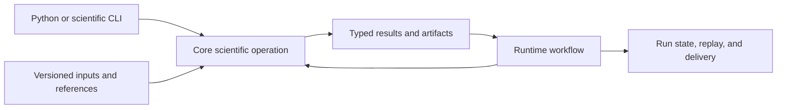

# Deployment Boundaries

Core is a scientific library with a command interface, not a long-running control plane. It can run inside a workstation process, batch job, notebook, worker, or container, while Runtime owns multi-step execution, durable run state, replay, provider coordination, and operator-facing services.

## Supported execution contexts

Direct Core execution is appropriate when one process can own the complete operation and the caller can provide explicit inputs, parameters, references, and output paths. Examples include format conversion, sequence processing, FDR review, matrix construction, study validation, or a bounded scientific report.

Use Runtime when work requires:

- durable run identifiers, checkpoints, retries, or resume;
- a dependency graph across several scientific operations;
- provider selection or external tool execution;
- artifact ledgers, replay, telemetry, or operator APIs;
- concurrent work whose state must survive process failure;
- environment capture and cross-run comparison.

Runtime may invoke Core, but it does not redefine Core's scientific algorithms or data meaning.

## Container and batch-job posture

A Core container should pin the package, Python version, optional format dependencies, and external reference assets required by its command. Mount inputs read-only where practical and write results to a dedicated artifact path. Capture stdout, stderr, exit status, warnings, parameters, and input fingerprints.

Do not infer reproducibility from an image tag alone. Results also depend on reference databases, search-engine outputs, instrument exports, thresholds, random seeds where applicable, and the exact artifact contract. Immutable image digests and immutable data references solve different parts of the problem.

## Failure ownership

| Failure | Owner |
| --- | --- |
| invalid sequence, scientific parameter, contrast, or evidence relationship | Core |
| unsupported or malformed scientific file | Core importer, with explicit parser diagnostics |
| missing optional Parquet dependency | environment packaging |
| queue loss, retry exhaustion, checkpoint recovery, or replay mismatch | Runtime |
| missing source file, storage outage, resource quota, or secret | deployment infrastructure |
| inappropriate biological conclusion from a valid result | Intelligence or the consuming reviewer |

## Boundary test

If a proposed deployment feature changes scientific output for the same typed inputs, it belongs in Core. If it changes when, where, how often, or under which operational recovery policy the same operation runs, it belongs in Runtime or infrastructure.
