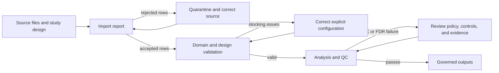

# Failure Recovery

A scientific pipeline can finish technically and still fail scientifically.
Recovery in the core package starts from the last trustworthy boundary and
preserves rejected rows, issue codes, configuration, and provenance so a
corrected run can be compared with the failed one.

## Find the last trustworthy boundary

Start with the earliest report that contains a failure. Import reports separate
accepted and rejected rows and attach stable row numbers, columns, issue codes,
and messages. Domain validation reports readiness, dependency, identifier, and
lifecycle inconsistencies. Analysis reports expose model, missingness,
target-decoy, false-discovery, ambiguity, and QC decisions. Do not diagnose a
late empty table before confirming that upstream rows were accepted.

Keep rejected records beside the accepted dataset. Deleting them changes the
denominator and can make a rerun appear healthier without correcting the
source. Correct source identifiers, delimiters, units, modification notation,
sample metadata, or design assignments in a new input. Never patch a rendered
result table to make it pass output validation.

## Rerun from explicit evidence

Use the same normalized configuration, study design, source files, reference
database, target-decoy policy, filtering thresholds, and software versions when
testing a recovery. Change only the field justified by the diagnosis and record
that change. If the scientific policy changes—such as an FDR threshold,
missingness rule, contrast, or protein-inference strategy—the result is a new
analysis, not a resumed equivalent.

Partial outputs must remain partial. A matrix with unresolved sample mapping, a
report with rejected rows, or an enrichment result built from an ineligible
protein set must not be promoted because a downstream renderer can consume it.
Use the relevant readiness, validity, and QC report as the gate.

## Compare the recovered run

Recovery is complete when import counts reconcile with the source, no blocking
issue is hidden, output-table validation passes, and provenance identifies the
inputs and policies used. Compare accepted and rejected counts, identifiers,
missingness, target and decoy counts, thresholds, QC status, and output
fingerprints. Explain expected differences; unexplained drift is a new finding,
not evidence that the failure is resolved.
