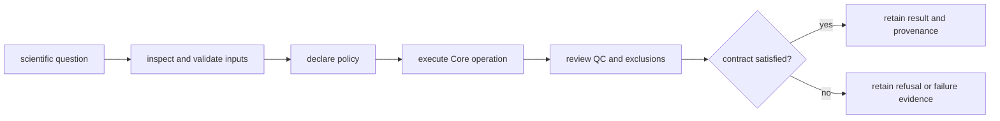

# Operating scientific workflows

Core operations begin with an explicit scientific question and end with an
artifact whose inputs, policy, exclusions, QC, and limitations can be reviewed.
The package can be used directly from Python or the CLI; long-running execution,
provider management, checkpoints, and replay belong to Runtime.

## Begin by workflow family

| Work | First route | Review before continuing |
| --- | --- | --- |
| FASTA and digestion | [common workflows](common-workflows.md) | header interpretation, contaminants, decoys, protease policy, peptide-space caveats |
| spectra and raw-format inspection | CLI and I/O owner guides | format support, metadata, centroid/profile assumptions, rejected spectra |
| search-result import and FDR | identification owner and artifact contracts | engine provenance, score orientation, decoys, thresholds, audit trail |
| protein inference and LFQ | inference and quantification guides | shared peptides, grouping, missingness, normalization, reproducibility |
| DIA, PTM, targeted, or multiplex | workflow-family owner | family-specific acceptance, ambiguity, interference, and evidence ceiling |
| interpretation and review | interpretation and review owner | source context, computed result versus judgment, downstream authority |
| benchmark or public claim | benchmark catalog and lineage | asset provenance, holdouts, acceptance bars, transfer limits |

## Environment and installation

Install only the extras needed by the selected workflow. Optional scientific
engines and file readers must fail explicitly when unavailable rather than
changing the analysis silently. [Installation and setup](installation-and-setup.md)
documents supported environments and extras; [deployment boundaries](deployment-boundaries.md)
explains when Runtime is required.

## Output discipline

Choose output paths before execution and retain the primary machine-readable
artifact, not only console output. For repository work, local run products
belong under `artifacts/`. A complete retained result includes:

- source and configuration identity;
- the primary result and rejected-input ledger;
- QC and diagnostic artifacts;
- external-engine provenance where applicable;
- schema and producer identity;
- refusal or failure evidence when no accepted result was produced.

## Failure interpretation

| Failure class | Meaning | Safe response |
| --- | --- | --- |
| parse or schema rejection | input cannot be interpreted under the declared contract | correct or explicitly transform the source; preserve rejection details |
| scientific refusal | evidence or assumptions cannot support the requested operation | narrow the question, provide missing evidence, or stop |
| optional capability unavailable | required dependency, engine, or environment is absent | install the declared extra or select an explicit alternative |
| QC or acceptance miss | computation completed but result does not meet the scientific bar | retain artifacts; do not promote the claim |
| operational interruption | process did not complete | use Runtime recovery if checkpoints or replay are required |

[Failure recovery](failure-recovery.md) distinguishes recoverable operational
conditions from scientific invalidity. [Observability and diagnostics](observability-and-diagnostics.md)
maps logs and artifacts to the owning contract.

## Scaling without changing meaning

Chunking, parallelism, caching, and streaming must preserve the serial
scientific contract: stable identity, ordering where promised, policy,
aggregation, rejections, and QC. A faster path requires equivalence evidence;
it cannot use performance pressure to weaken validation or omit provenance.

See [performance and scaling](performance-and-scaling.md) for supported routes
and [security and safety](security-and-safety.md) for untrusted files, external
tools, and resource boundaries.

## Publication boundary

A package release can be operationally sound while a workflow family remains
scientifically bounded. [Release and versioning](release-and-versioning.md)
connects API and artifact compatibility to distribution changes. Public
workflow claims additionally require current benchmark lineage, acceptance,
rerun, grounding, decision, and consequence evidence.
