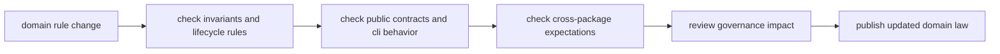

# Operations

`bijux-proteomics-core` operations is about changing domain law carefully. When
this package moves, progression rules, validation behavior, and operator
expectations can all move with it. The job here is to keep the central program
model coherent while still letting the repository evolve.

## What Operations Means Here

- the most dangerous failures are invalid program progression and silent contract
  drift
- local tests matter, but cross-package invariants matter just as much because
  neighbors depend on this layer's authority
- release notes should explain rule movement, not just code movement

## Start With

- open [Common Workflows](https://bijux.io/bijux-proteomics/04-bijux-proteomics-core/operations/common-workflows/)
  when you need the normal route from change to domain proof
- open [Local Development](https://bijux.io/bijux-proteomics/04-bijux-proteomics-core/operations/local-development/)
  when you are actively editing lifecycle, review, assay, or target behavior
- open [Failure Recovery](https://bijux.io/bijux-proteomics/04-bijux-proteomics-core/operations/failure-recovery/)
  when a workflow already violated a contract or stage expectation
- open [Release and Versioning](https://bijux.io/bijux-proteomics/04-bijux-proteomics-core/operations/release-and-versioning/)
  before publishing changes that alter the meaning of readiness or progression

## Route From Risk

- [Installation and Setup](https://bijux.io/bijux-proteomics/04-bijux-proteomics-core/operations/installation-and-setup/)
  and [Observability and Diagnostics](https://bijux.io/bijux-proteomics/04-bijux-proteomics-core/operations/observability-and-diagnostics/)
  for reproducing domain behavior and finding which rule failed
- [Deployment Boundaries](https://bijux.io/bijux-proteomics/04-bijux-proteomics-core/operations/deployment-boundaries/)
  and [Security and Safety](https://bijux.io/bijux-proteomics/04-bijux-proteomics-core/operations/security-and-safety/)
  for the boundaries that keep core from becoming runtime-by-accident
- [Performance and Scaling](https://bijux.io/bijux-proteomics/04-bijux-proteomics-core/operations/performance-and-scaling/)
  when large program sets or validation cost become a real operational factor

## First Proof Check

- `src/bijux_proteomics/program_spec.py` and `targets.py`
- `src/bijux_proteomics/lifecycle.py` and `validation.py`
- `packages/bijux-proteomics-core/tests`
