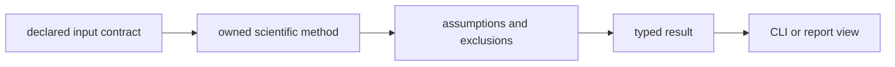

# Local development

Core owns scientific representations and deterministic processing: sequence
intake, digestion, identification, quantification, PTM handling, study design,
statistics, reporting, and the CLI that exposes those capabilities. Local work
must preserve the distinction between a scientific contract, an algorithm, and
the reviewer-facing evidence produced by that algorithm.

## Run focused gates

Use root package dispatch so Core is installed with Foundation and the packages
that its integration tests exercise.

```bash
make lint PACKAGE=bijux-proteomics-core
make test PACKAGE=bijux-proteomics-core
make quality PACKAGE=bijux-proteomics-core
make api PACKAGE=bijux-proteomics-core
```

Run `make build PACKAGE=bijux-proteomics-core` for public imports, CLI
packaging, metadata, or bundled reference data. Run the narrow test module
during development, then the package gate before committing.

## Trace a scientific change



Begin at the owning module rather than the CLI command. For example, a FASTA
change starts in `sequences/`, a study-design change in `study/design/`, and a
quantification change in `quantification/`. The interface layer parses and
renders; it must not become a second home for scientific rules.

## Prove the right property

| Change | Required evidence |
| --- | --- |
| parser or normalizer | accepted, rejected, ambiguous, and round-trip cases |
| scientific calculation | curated reference values, units, tolerances, and edge cases |
| review policy | explicit assumptions, exclusions, thresholds, and refusal behavior |
| CLI command | domain result plus exit, JSON, and tabular rendering contracts |
| root export | import stability and compatibility-alias forwarding |
| artifact schema | deterministic serialization and downstream load proof |

Do not judge a scientific edit only by higher coverage or a newly passing
fixture. State which invariant the case establishes and why the expected value
is authoritative. Approximate numerical results need declared tolerances;
categorical results need the boundary cases that separate adjacent outcomes.

## Protect package ownership

Execution retries, run ledgers, and provider orchestration belong to Runtime.
Evidence memory belongs to Knowledge, recommendations to Intelligence, and
physical execution authority to Lab. Core may create scientific evidence for
those packages, but it must not import their policy back into the calculation.

The change is ready when the scientific owner is unambiguous, inputs and units
are validated, assumptions and failures remain inspectable, interfaces are
thin, and representative consumers can use the result without reinterpreting
its meaning.
